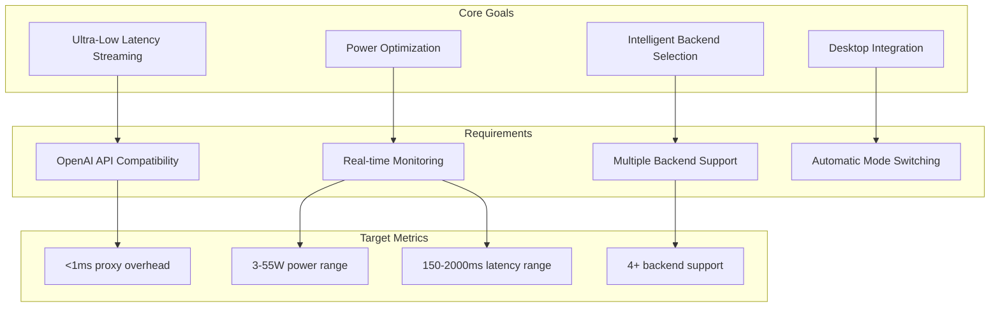
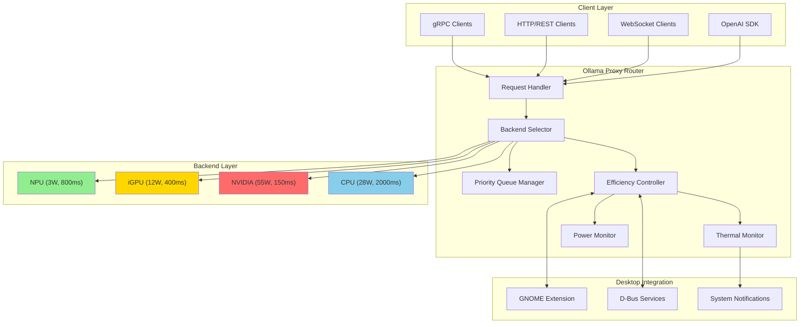
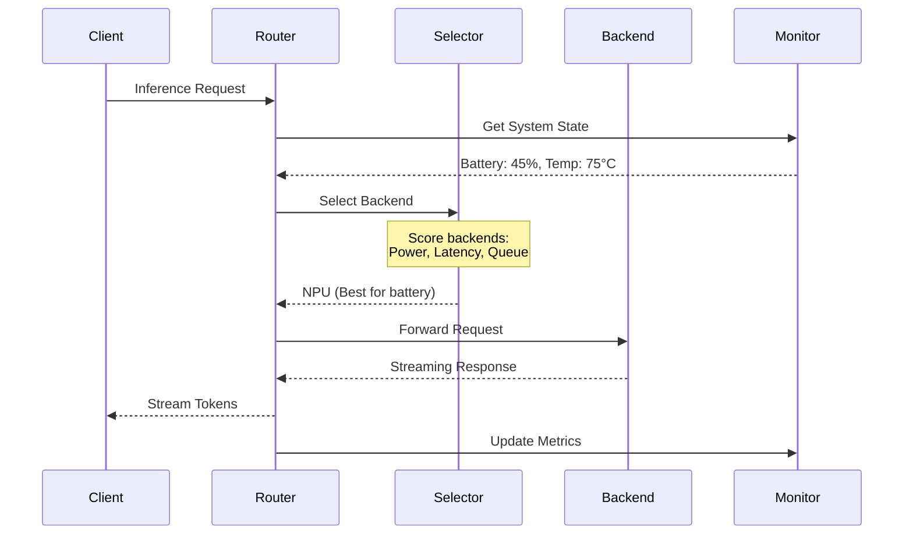

# Ollama Proxy

**Intelligent multi-backend AI inference router with power-aware routing, thermal monitoring, and GNOME desktop integration.**

[](LICENSE)
[](https://golang.org/)
[](https://www.gnome.org/)

---

## Overview

Ollama Proxy is a high-performance inference router that intelligently distributes AI workloads across multiple compute backends (NPU, GPU, CPU) with real-time power monitoring, thermal management, and desktop integration.

**Key Features:**
- 🔀 **Multi-Backend Routing** - NPU, iGPU, NVIDIA GPU, CPU support
- ⚡ **Power-Aware Routing** - Route based on power consumption (3W-55W range)
- 🌡️ **Thermal Monitoring** - Real-time temperature and fan speed tracking
- 🎯 **Priority Queuing** - Critical requests (voice, realtime) get priority
- 🚀 **Ultra-Low Latency** - <1ms proxy overhead with WebSocket streaming
- 🔌 **OpenAI Compatible** - Drop-in replacement for OpenAI API
- 🖥️ **GNOME Integration** - Quick Settings panel integration
- 📊 **D-Bus Services** - System-wide monitoring and control

---

## Goals & Requirements



---

## Architecture

### High-Level System Architecture



### Request Flow



---

## Quick Start

### Prerequisites

- Go 1.21 or higher
- Linux system (GNOME desktop optional)
- Ollama installed and running on backends
- systemd (optional, for service management)

### Installation

```bash
# Clone the repository
git clone https://github.com/daoneill/ollama-proxy.git
cd ollama-proxy

# Build the proxy
go build -o ollama-proxy ./cmd/proxy

# Copy to system location
sudo cp ollama-proxy /usr/local/bin/

# Install GNOME integration (optional)
./scripts/install-gnome-integration.sh
```

### Configuration

Edit `config/config.yaml`:

```yaml
server:
  grpc_port: 50051
  http_port: 8080
  host: "0.0.0.0"

router:
  power_aware: true
  auto_optimize: true

backends:
  - id: ollama-npu
    type: ollama
    name: "Ollama NPU"
    hardware: npu
    enabled: true
    endpoint: "http://localhost:11434"
    characteristics:
      power_watts: 3.0
      avg_latency_ms: 800
      priority: 3
```

### Running

```bash
# Run directly
./ollama-proxy

# Or use systemd (after installation)
systemctl --user start ie.fio.ollamaproxy.service
systemctl --user status ie.fio.ollamaproxy.service

# View logs
journalctl --user -u ie.fio.ollamaproxy.service -f
```

---

## Usage Examples

### OpenAI-Compatible API

```bash
# Chat completion (streaming)
curl http://localhost:8080/v1/chat/completions \
  -H "Content-Type: application/json" \
  -H "X-Priority: critical" \
  -d '{
    "model": "qwen2.5:0.5b",
    "messages": [{"role": "user", "content": "Hello!"}],
    "stream": true
  }'

# With routing control
curl http://localhost:8080/v1/chat/completions \
  -H "X-Latency-Critical: true" \
  -H "X-Max-Power-Watts: 15" \
  -d '{
    "model": "qwen2.5:0.5b",
    "messages": [{"role": "user", "content": "Explain quantum computing"}]
  }'
```

### WebSocket Streaming (Ultra-Low Latency)

```javascript
const ws = new WebSocket('ws://localhost:8080/v1/stream/ws');

ws.onopen = () => {
  ws.send(JSON.stringify({
    request_id: "voice-001",
    model: "qwen2.5:0.5b",
    prompt: "Transcribe: Hello world",
    stream: true,
    priority: "critical",
    max_latency_ms: 50
  }));
};

ws.onmessage = (event) => {
  const chunk = JSON.parse(event.data);
  console.log(`Token: ${chunk.token}, TTFT: ${chunk.ttft_ms}ms`);
};
```

### gRPC API

```bash
# List available services
grpcurl -plaintext localhost:50051 list

# Generate text
grpcurl -plaintext -d '{
  "prompt": "Explain AI",
  "model": "qwen2.5:0.5b",
  "annotations": {"latency_critical": true}
}' localhost:50051 ollama_proxy.OllamaProxy/Generate
```

### GNOME Integration

After installing the GNOME extension and restarting GNOME Shell:

1. Click the **Quick Settings** panel (top-right)
2. Find **"AI Efficiency"** toggle
3. Select efficiency mode:
   - **Performance** - Fastest (NVIDIA GPU preferred)
   - **Balanced** - Balanced power/performance
   - **Efficiency** - Lowest power (NPU preferred)
   - **Quiet** - Minimize fan noise
   - **Auto** - Automatic based on battery/temperature
   - **Ultra Efficiency** - Maximum battery saving

---

## Performance

### Streaming Optimizations

The proxy implements **10 critical optimizations** for ultra-low latency streaming:

| Optimization | Latency Saved | Benefit |
|-------------|---------------|---------|
| Connection pooling | -1-10ms per request | Reuses TCP connections |
| Optimized buffers (4KB) | -10-500μs per token | Smaller buffer, lower latency |
| Object pooling | -30-150μs per token | Eliminates allocations |
| Priority queuing | N/A | Critical requests bypass queue |
| Backpressure control | N/A | Prevents memory buildup |
| WebSocket passthrough | -100-400μs per token | Zero-copy streaming |

**Total Proxy Overhead:**
- Before optimizations: 1.2-9.6ms per token (9-18% of total)
- After optimizations: **0.05-0.5ms per token (<1% of total)**

### Benchmark Results

```
Voice Processing (20 tokens):
  NPU Backend: 400ms total (20ms/token)
  Proxy Overhead: 8ms (2% of total) ✅

High-Throughput Batch:
  NVIDIA Backend: 100 tokens in 3.2s (32 tokens/sec)
  Connection Reuse: 0ms setup (vs 10ms per request)
  Object Pooling: 50% reduction in GC pauses
```

---

## Features

### Multi-Backend Routing

Automatically routes requests to the best backend based on:
- **Latency requirements** - Fast requests to NVIDIA GPU
- **Power constraints** - Battery-powered to NPU (3W)
- **Thermal state** - High temperature to lower power backends
- **Queue depth** - Avoid congested backends
- **Priority level** - Critical requests get priority

See [docs/features/routing.md](docs/features/routing.md)

### Power-Aware Routing

Optimize for power consumption based on:
- Battery level (Auto mode)
- AC vs battery power
- Maximum power budget (X-Max-Power-Watts header)
- Efficiency mode setting

See [docs/features/power-management.md](docs/features/power-management.md)

### Thermal Monitoring

Real-time monitoring of:
- CPU/GPU temperatures
- Fan speeds
- Thermal throttling detection
- Automatic mode switching on thermal events

See [docs/features/thermal-monitoring.md](docs/features/thermal-monitoring.md)

### Efficiency Modes

Six efficiency modes for different scenarios:
- **Performance** - Maximum performance, ignore power
- **Balanced** - Balance between power and latency
- **Efficiency** - Minimize power consumption
- **Quiet** - Minimize fan noise and temperature
- **Auto** - Automatic based on system state
- **Ultra Efficiency** - Extreme battery saving (<10W)

See [docs/features/efficiency-modes.md](docs/features/efficiency-modes.md)

### Priority Queuing

Four priority levels:
- **Best Effort** (0) - Batch jobs, non-critical
- **Normal** (1) - Default priority
- **High** (2) - Important workloads
- **Critical** (3) - Voice, realtime streams

See [docs/features/priority-queuing.md](docs/features/priority-queuing.md)

---

## HTTP API Reference

### Endpoints

```
GET  /health                    # Health check
GET  /backends                  # List backends
GET  /thermal                   # Thermal status
GET  /efficiency                # Current efficiency mode
POST /efficiency                # Set efficiency mode

POST /v1/chat/completions       # OpenAI chat completions
POST /v1/completions            # OpenAI completions
POST /v1/embeddings             # OpenAI embeddings
GET  /v1/models                 # List models

WS   /v1/stream/ws              # WebSocket streaming
```

### Routing Headers

Control routing behavior with HTTP headers:

```
X-Target-Backend: ollama-npu          # Explicit backend selection
X-Latency-Critical: true              # Route to fastest backend
X-Power-Efficient: true               # Route to lowest power backend
X-Max-Latency-Ms: 500                 # Maximum acceptable latency
X-Max-Power-Watts: 15                 # Maximum power budget
X-Priority: critical                  # Request priority level
X-Request-ID: req-001                 # Request tracking ID
X-Media-Type: realtime                # Workload type hint
```

### Response Headers

Routing metadata returned in responses:

```
X-Backend-Used: ollama-npu            # Backend that processed request
X-Estimated-Latency-Ms: 800           # Estimated latency
X-Estimated-Power-W: 3.0              # Estimated power consumption
X-Routing-Reason: latency-critical    # Why this backend was chosen
X-Alternatives: ollama-igpu,ollama-nvidia  # Alternative backends
```

---

## D-Bus Services

System-wide monitoring and control via D-Bus:

### Available Services

```
ie.fio.OllamaProxy.Efficiency      # Efficiency mode control
ie.fio.OllamaProxy.Backends        # Backend monitoring
ie.fio.OllamaProxy.Routing         # Routing statistics
ie.fio.OllamaProxy.Thermal         # Thermal monitoring
ie.fio.OllamaProxy.SystemState     # System state (battery, etc)
```

See [docs/api/dbus-services.md](docs/api/dbus-services.md)

---

## Troubleshooting

### Service won't start

```bash
# Check logs
journalctl --user -u ie.fio.ollamaproxy.service -n 50

# Common issues:
# 1. Config file not found - check WorkingDirectory in service file
# 2. Port already in use - check if another instance is running
# 3. Backend unreachable - verify Ollama is running on backends
```

### GNOME extension not showing

```bash
# Verify extension is installed
ls ~/.local/share/gnome-shell/extensions/ollamaproxy@anthropic.com/

# Check if enabled
gnome-extensions list | grep ollama

# Enable manually
gnome-extensions enable ollamaproxy@anthropic.com

# Restart GNOME Shell (X11)
Alt+F2, type 'r', press Enter

# Restart GNOME Shell (Wayland)
Log out and log back in
```

See [docs/guides/troubleshooting.md](docs/guides/troubleshooting.md)

---

## Documentation

- [Features](docs/features/)
  - [Multi-Backend Routing](docs/features/routing.md)
  - [Power Management](docs/features/power-management.md)
  - [Thermal Monitoring](docs/features/thermal-monitoring.md)
  - [Efficiency Modes](docs/features/efficiency-modes.md)
  - [Priority Queuing](docs/features/priority-queuing.md)
  - [Streaming Optimizations](docs/features/streaming-optimizations.md)

- [API Reference](docs/api/)
  - [OpenAI Compatibility](docs/api/openai-compatibility.md)
  - [gRPC API](docs/api/grpc-api.md)
  - [WebSocket API](docs/api/websocket-api.md)
  - [D-Bus Services](docs/api/dbus-services.md)

- [Guides](docs/guides/)
  - [Installation](docs/guides/installation.md)
  - [Configuration](docs/guides/configuration.md)
  - [GNOME Integration](docs/guides/gnome-integration.md)
  - [Troubleshooting](docs/guides/troubleshooting.md)

---

## License

MIT License - see [LICENSE](LICENSE) file for details.

---

## Acknowledgments

- [Ollama](https://ollama.ai/) - Local LLM runtime
- [gRPC](https://grpc.io/) - High-performance RPC framework
- [Gorilla WebSocket](https://github.com/gorilla/websocket) - WebSocket implementation
- GNOME Project - Desktop integration APIs

---

**Made with ❤️ for efficient AI inference**
