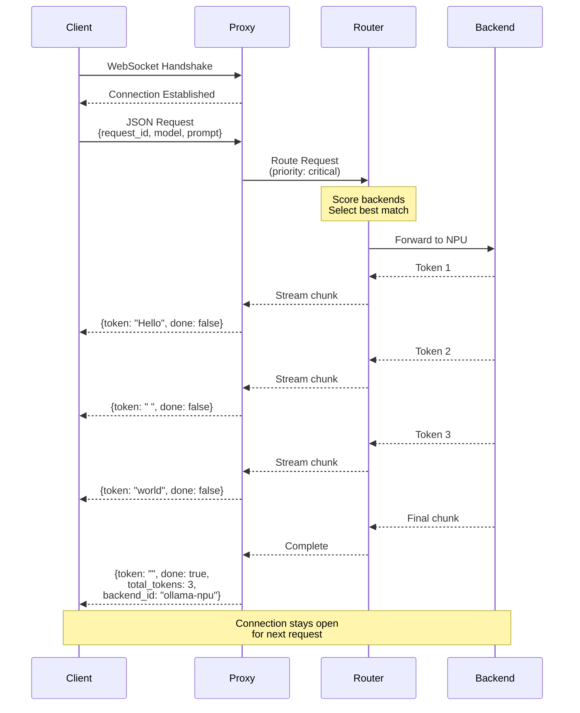

# WebSocket API

The Ollama Proxy provides an **ultra-low latency WebSocket API** optimized for realtime applications like voice transcription, live chat, and interactive streaming.

---

## Overview

The WebSocket API offers:
- **Lowest latency** - Direct token passthrough, <100μs per token overhead
- **Bidirectional communication** - Send control messages during streaming
- **Persistent connection** - No connection setup overhead per request
- **Zero-copy streaming** - Minimal JSON conversion
- **Backpressure handling** - Flow control for slow clients

### Performance Comparison

| API | Overhead per Token | Connection Setup | Use Case |
|-----|-------------------|------------------|----------|
| **WebSocket** | **<100μs** | One-time | Voice, realtime chat |
| gRPC | ~200μs | One-time | Microservices |
| OpenAI REST | ~500μs | Per-request | General purpose |

---

## Connection

### Endpoint

```
ws://localhost:8080/v1/stream/ws
```

### Connect Examples

**JavaScript (Browser):**
```javascript
const ws = new WebSocket('ws://localhost:8080/v1/stream/ws');

ws.onopen = () => {
  console.log('Connected');
};

ws.onmessage = (event) => {
  const chunk = JSON.parse(event.data);
  console.log('Token:', chunk.token);
};

ws.onerror = (error) => {
  console.error('WebSocket error:', error);
};

ws.onclose = () => {
  console.log('Connection closed');
};
```

**Python (websocket-client):**
```python
import websocket
import json

def on_message(ws, message):
    chunk = json.loads(message)
    print(chunk['token'], end='', flush=True)

def on_open(ws):
    request = {
        "request_id": "req-001",
        "model": "qwen2.5:0.5b",
        "prompt": "Hello!",
        "stream": True
    }
    ws.send(json.dumps(request))

ws = websocket.WebSocketApp(
    "ws://localhost:8080/v1/stream/ws",
    on_open=on_open,
    on_message=on_message
)

ws.run_forever()
```

**Node.js (ws):**
```javascript
const WebSocket = require('ws');

const ws = new WebSocket('ws://localhost:8080/v1/stream/ws');

ws.on('open', () => {
  ws.send(JSON.stringify({
    request_id: 'req-001',
    model: 'qwen2.5:0.5b',
    prompt: 'Hello!',
    stream: true
  }));
});

ws.on('message', (data) => {
  const chunk = JSON.parse(data);
  process.stdout.write(chunk.token || '');
});
```

**wscat (CLI):**
```bash
# Install wscat
npm install -g wscat

# Connect
wscat -c ws://localhost:8080/v1/stream/ws

# Send request (paste JSON)
{"request_id":"req-001","model":"qwen2.5:0.5b","prompt":"Hello!","stream":true}
```

---

## Protocol

### WebSocket Message Flow



### Request Format

Send a JSON request immediately after connecting:

```json
{
  "request_id": "voice-001",
  "model": "qwen2.5:0.5b",
  "prompt": "Transcribe: Hello world",
  "stream": true,
  "options": {
    "temperature": 0.7,
    "max_tokens": 100
  },
  "annotations": {
    "priority": "critical",
    "max_latency_ms": 50
  }
}
```

#### Request Fields

| Field | Type | Required | Description |
|-------|------|----------|-------------|
| `request_id` | string | Yes | Unique request identifier |
| `model` | string | Yes | Model name (e.g., "qwen2.5:0.5b") |
| `prompt` | string | Yes | Input prompt |
| `stream` | boolean | No | Enable streaming (default: true) |
| `options` | object | No | Generation options |
| `annotations` | object | No | Routing annotations |

#### Options Object

```json
{
  "temperature": 0.7,
  "top_p": 0.9,
  "top_k": 40,
  "max_tokens": 150,
  "stop": ["\n", "END"]
}
```

#### Annotations Object

```json
{
  "priority": "critical",
  "latency_critical": true,
  "max_latency_ms": 50,
  "max_power_watts": 15,
  "target_backend": "ollama-nvidia"
}
```

### Response Format

Receive streaming JSON chunks:

```json
{
  "request_id": "voice-001",
  "token": "Hello",
  "done": false,
  "ttft_ms": 45
}
```

**Final chunk:**
```json
{
  "request_id": "voice-001",
  "token": "",
  "done": true,
  "total_tokens": 20,
  "total_duration_ms": 445,
  "backend_id": "ollama-nvidia"
}
```

#### Response Fields

| Field | Type | Always Present | Description |
|-------|------|----------------|-------------|
| `request_id` | string | Yes | Matches request ID |
| `token` | string | Yes | Generated token (empty if done) |
| `done` | boolean | Yes | True on final chunk |
| `ttft_ms` | integer | First chunk | Time to first token (ms) |
| `total_tokens` | integer | Final chunk | Total tokens generated |
| `total_duration_ms` | integer | Final chunk | Total generation time |
| `backend_id` | string | Final chunk | Backend that processed request |

### Error Format

Errors sent as JSON:

```json
{
  "error": "No healthy backends available",
  "code": "no_backends",
  "request_id": "voice-001"
}
```

---

## Usage Examples

### Simple Chat Streaming

```javascript
const ws = new WebSocket('ws://localhost:8080/v1/stream/ws');

ws.onopen = () => {
  // Send chat request
  ws.send(JSON.stringify({
    request_id: 'chat-' + Date.now(),
    model: 'qwen2.5:0.5b',
    prompt: 'Tell me a short joke',
    stream: true
  }));
};

ws.onmessage = (event) => {
  const chunk = JSON.parse(event.data);

  if (chunk.error) {
    console.error('Error:', chunk.error);
    ws.close();
    return;
  }

  if (!chunk.done) {
    // Display token
    process.stdout.write(chunk.token);
  } else {
    // Stream complete
    console.log(`\n\nTokens: ${chunk.total_tokens}`);
    console.log(`Duration: ${chunk.total_duration_ms}ms`);
    console.log(`Backend: ${chunk.backend_id}`);
    ws.close();
  }
};
```

### Voice Transcription (Low Latency)

```javascript
const ws = new WebSocket('ws://localhost:8080/v1/stream/ws');

ws.onopen = () => {
  ws.send(JSON.stringify({
    request_id: 'voice-' + Date.now(),
    model: 'qwen2.5:0.5b',
    prompt: 'Transcribe: [audio input]',
    stream: true,
    annotations: {
      priority: 'critical',          // Highest priority
      latency_critical: true,        // Route to fastest backend
      max_latency_ms: 50,            // 50ms max acceptable
      max_power_watts: 100           // Allow high-power backends
    }
  }));
};

let firstTokenTime = null;

ws.onmessage = (event) => {
  const chunk = JSON.parse(event.data);

  if (chunk.ttft_ms) {
    firstTokenTime = chunk.ttft_ms;
    console.log(`TTFT: ${firstTokenTime}ms`);
  }

  if (!chunk.done) {
    // Process token immediately
    displayToken(chunk.token);
  } else {
    console.log(`\nAvg latency: ${chunk.total_duration_ms / chunk.total_tokens}ms/token`);
  }
};

function displayToken(token) {
  // Display token to user with minimal delay
  document.getElementById('transcription').textContent += token;
}
```

### Batch Processing with Multiple Requests

```javascript
const ws = new WebSocket('ws://localhost:8080/v1/stream/ws');

const documents = [
  'Document 1 text...',
  'Document 2 text...',
  'Document 3 text...'
];

let currentDoc = 0;
const summaries = {};

ws.onopen = () => {
  // Send first request
  sendNextDocument();
};

function sendNextDocument() {
  if (currentDoc >= documents.length) {
    console.log('All documents processed');
    ws.close();
    return;
  }

  const requestId = `doc-${currentDoc}`;
  ws.send(JSON.stringify({
    request_id: requestId,
    model: 'qwen2.5:0.5b',
    prompt: `Summarize: ${documents[currentDoc]}`,
    stream: true,
    annotations: {
      priority: 'best-effort'  // Low priority for batch
    }
  }));

  summaries[requestId] = '';
  currentDoc++;
}

ws.onmessage = (event) => {
  const chunk = JSON.parse(event.data);

  if (!chunk.done) {
    summaries[chunk.request_id] += chunk.token;
  } else {
    console.log(`Summary for ${chunk.request_id}:`);
    console.log(summaries[chunk.request_id]);
    console.log('---');

    // Send next document
    sendNextDocument();
  }
};
```

### Python Async Example

```python
import asyncio
import websockets
import json

async def voice_stream():
    uri = "ws://localhost:8080/v1/stream/ws"

    async with websockets.connect(uri) as websocket:
        # Send request
        request = {
            "request_id": "voice-001",
            "model": "qwen2.5:0.5b",
            "prompt": "Transcribe: Hello world",
            "stream": True,
            "annotations": {
                "priority": "critical",
                "max_latency_ms": 50
            }
        }
        await websocket.send(json.dumps(request))

        # Receive tokens
        async for message in websocket:
            chunk = json.loads(message)

            if 'error' in chunk:
                print(f"Error: {chunk['error']}")
                break

            if chunk.get('ttft_ms'):
                print(f"TTFT: {chunk['ttft_ms']}ms")

            if not chunk['done']:
                print(chunk['token'], end='', flush=True)
            else:
                print(f"\n\nTokens: {chunk['total_tokens']}")
                print(f"Duration: {chunk['total_duration_ms']}ms")
                print(f"Backend: {chunk['backend_id']}")
                break

asyncio.run(voice_stream())
```

---

## Advanced Features

### Connection Reuse

Keep connection open for multiple requests:

```javascript
const ws = new WebSocket('ws://localhost:8080/v1/stream/ws');

const requests = [
  { request_id: 'req-1', prompt: 'Hello' },
  { request_id: 'req-2', prompt: 'How are you?' },
  { request_id: 'req-3', prompt: 'Goodbye' }
];

let currentRequest = 0;
const responses = {};

ws.onopen = () => {
  sendNextRequest();
};

function sendNextRequest() {
  if (currentRequest >= requests.length) {
    ws.close();
    return;
  }

  const req = requests[currentRequest++];
  ws.send(JSON.stringify({
    ...req,
    model: 'qwen2.5:0.5b',
    stream: true
  }));

  responses[req.request_id] = '';
}

ws.onmessage = (event) => {
  const chunk = JSON.parse(event.data);

  if (!chunk.done) {
    responses[chunk.request_id] += chunk.token;
  } else {
    console.log(`${chunk.request_id}: ${responses[chunk.request_id]}`);
    sendNextRequest();  // Send next on completion
  }
};
```

### Timeout Handling

```javascript
const TIMEOUT_MS = 30000;  // 30 seconds

const ws = new WebSocket('ws://localhost:8080/v1/stream/ws');
let timeoutId;

function resetTimeout() {
  clearTimeout(timeoutId);
  timeoutId = setTimeout(() => {
    console.error('Timeout: No response received');
    ws.close();
  }, TIMEOUT_MS);
}

ws.onopen = () => {
  resetTimeout();
  ws.send(JSON.stringify({
    request_id: 'req-001',
    model: 'qwen2.5:0.5b',
    prompt: 'Hello',
    stream: true
  }));
};

ws.onmessage = (event) => {
  resetTimeout();  // Reset timeout on each message
  const chunk = JSON.parse(event.data);
  // ... process chunk
};

ws.onclose = () => {
  clearTimeout(timeoutId);
};
```

### Reconnection Logic

```javascript
function createReconnectingWebSocket(url, maxRetries = 5) {
  let ws = null;
  let retries = 0;

  function connect() {
    ws = new WebSocket(url);

    ws.onopen = () => {
      console.log('Connected');
      retries = 0;  // Reset retry counter
    };

    ws.onclose = () => {
      if (retries < maxRetries) {
        retries++;
        const delay = Math.min(1000 * Math.pow(2, retries), 30000);
        console.log(`Reconnecting in ${delay}ms (attempt ${retries}/${maxRetries})`);
        setTimeout(connect, delay);
      } else {
        console.error('Max reconnection attempts reached');
      }
    };

    ws.onerror = (error) => {
      console.error('WebSocket error:', error);
    };

    return ws;
  }

  return connect();
}

const ws = createReconnectingWebSocket('ws://localhost:8080/v1/stream/ws');
```

---

## Performance Optimization

### Minimize JSON Parsing Overhead

```javascript
// ✅ Good: Parse once
ws.onmessage = (event) => {
  const chunk = JSON.parse(event.data);
  processChunk(chunk);
};

// ❌ Bad: Multiple parse calls
ws.onmessage = (event) => {
  if (JSON.parse(event.data).done) {
    const chunk = JSON.parse(event.data);  // Parsed twice!
    // ...
  }
};
```

### Buffer Control

```javascript
// Adjust buffer sizes for low latency
const ws = new WebSocket('ws://localhost:8080/v1/stream/ws');

// Set small buffer for minimal latency
ws.binaryType = 'arraybuffer';
ws.bufferedAmount;  // Check buffered data
```

### Backpressure Handling

```python
import asyncio
import websockets

async def handle_backpressure():
    uri = "ws://localhost:8080/v1/stream/ws"

    async with websockets.connect(uri) as ws:
        await ws.send(json.dumps({
            "request_id": "req-001",
            "model": "qwen2.5:0.5b",
            "prompt": "Generate text",
            "stream": True
        }))

        # Process with backpressure
        async for message in ws:
            chunk = json.loads(message)

            # Slow processing
            await slow_processing(chunk['token'])

            # WebSocket handles backpressure automatically
            # Server will slow down if client can't keep up

asyncio.run(handle_backpressure())
```

---

## Error Handling

### Common Errors

| Error Code | Message | Cause |
|------------|---------|-------|
| `invalid_request` | "Missing required field: model" | Invalid request format |
| `no_backends` | "No healthy backends available" | All backends unhealthy |
| `model_not_found` | "Model not found: llama3.2:70b" | Model not supported |
| `timeout` | "Backend timeout" | Backend took too long |
| `connection_closed` | "Connection closed by server" | Server shutdown |

### Error Handling Example

```javascript
ws.onmessage = (event) => {
  const data = JSON.parse(event.data);

  if (data.error) {
    switch (data.code) {
      case 'no_backends':
        console.error('All backends busy, retry later');
        setTimeout(() => retryRequest(), 5000);
        break;

      case 'model_not_found':
        console.error('Model not available:', data.error);
        // Try different model
        break;

      case 'timeout':
        console.error('Request timeout, retry');
        retryRequest();
        break;

      default:
        console.error('Unknown error:', data.error);
    }

    ws.close();
    return;
  }

  // Normal processing
  processChunk(data);
};
```

---

## Testing

### wscat (CLI Testing)

```bash
# Connect
wscat -c ws://localhost:8080/v1/stream/ws

# Send request (paste after connecting)
{"request_id":"test-001","model":"qwen2.5:0.5b","prompt":"Hello","stream":true}

# Watch streaming response
```

### Python Test Script

```python
import websockets
import asyncio
import json

async def test_websocket():
    uri = "ws://localhost:8080/v1/stream/ws"

    try:
        async with websockets.connect(uri) as ws:
            # Send request
            request = {
                "request_id": "test-001",
                "model": "qwen2.5:0.5b",
                "prompt": "Count to 5",
                "stream": True
            }
            await ws.send(json.dumps(request))
            print("Request sent")

            # Receive response
            tokens = []
            async for message in ws:
                chunk = json.loads(message)

                if 'error' in chunk:
                    print(f"Error: {chunk['error']}")
                    break

                if not chunk['done']:
                    tokens.append(chunk['token'])
                    print(f"Token: {chunk['token']}")
                else:
                    print(f"\n\nComplete!")
                    print(f"Total tokens: {chunk['total_tokens']}")
                    print(f"Duration: {chunk['total_duration_ms']}ms")
                    print(f"Backend: {chunk['backend_id']}")
                    print(f"Response: {''.join(tokens)}")
                    break

    except websockets.exceptions.WebSocketException as e:
        print(f"WebSocket error: {e}")
    except Exception as e:
        print(f"Error: {e}")

asyncio.run(test_websocket())
```

### Load Testing

```python
import asyncio
import websockets
import json
import time

async def single_request(request_id):
    uri = "ws://localhost:8080/v1/stream/ws"

    start = time.time()

    async with websockets.connect(uri) as ws:
        await ws.send(json.dumps({
            "request_id": request_id,
            "model": "qwen2.5:0.5b",
            "prompt": "Hello",
            "stream": True
        }))

        async for message in ws:
            chunk = json.loads(message)
            if chunk['done']:
                duration = time.time() - start
                return {
                    'request_id': request_id,
                    'duration': duration,
                    'tokens': chunk['total_tokens']
                }

async def load_test(concurrent_requests=10):
    tasks = [
        single_request(f"req-{i}")
        for i in range(concurrent_requests)
    ]

    results = await asyncio.gather(*tasks)

    # Calculate statistics
    durations = [r['duration'] for r in results]
    avg_duration = sum(durations) / len(durations)
    max_duration = max(durations)
    min_duration = min(durations)

    print(f"Concurrent requests: {concurrent_requests}")
    print(f"Avg duration: {avg_duration:.2f}s")
    print(f"Min duration: {min_duration:.2f}s")
    print(f"Max duration: {max_duration:.2f}s")

asyncio.run(load_test(concurrent_requests=50))
```

---

## Best Practices

### 1. Use WebSocket for Voice/Realtime Only

WebSocket has the lowest latency but requires persistent connection:

**Use WebSocket when:**
- Voice transcription (TTFT <50ms critical)
- Live chat (immediate token display)
- Interactive applications (continuous streaming)

**Use OpenAI REST when:**
- Batch processing (don't need persistent connection)
- Simple request/response (overhead acceptable)
- Browser compatibility (some browsers/proxies block WebSocket)

### 2. Set Critical Priority for Voice

```javascript
ws.send(JSON.stringify({
  request_id: 'voice-001',
  model: 'qwen2.5:0.5b',
  prompt: 'Transcribe audio',
  stream: true,
  annotations: {
    priority: 'critical',      // ✅ Ensures fast routing
    latency_critical: true,    // ✅ Routes to fastest backend
    max_latency_ms: 50         // ✅ Filters slow backends
  }
}));
```

### 3. Handle Connection Drops

```javascript
ws.onclose = (event) => {
  if (event.code !== 1000) {
    // Abnormal close, attempt reconnect
    console.log(`Connection closed: ${event.code}`);
    setTimeout(reconnect, 1000);
  }
};
```

### 4. Monitor TTFT

```javascript
let ttft = null;

ws.onmessage = (event) => {
  const chunk = JSON.parse(event.data);

  if (chunk.ttft_ms && !ttft) {
    ttft = chunk.ttft_ms;
    console.log(`TTFT: ${ttft}ms`);

    // Alert if too high
    if (ttft > 100) {
      console.warn('High TTFT detected, voice quality may be degraded');
    }
  }
};
```

### 5. Close Connection When Done

```javascript
ws.onmessage = (event) => {
  const chunk = JSON.parse(event.data);

  if (chunk.done) {
    // Process final chunk
    console.log('Complete');

    // Close connection (don't leave it hanging)
    ws.close(1000, 'Normal closure');
  }
};
```

---

## Related Documentation

- [OpenAI API Compatibility](openai-compatibility.md) - REST API alternative
- [gRPC API](grpc-api.md) - High-performance RPC
- [Streaming Optimizations](../features/streaming-optimizations.md) - Performance details
- [Priority Queuing](../features/priority-queuing.md) - Request prioritization
