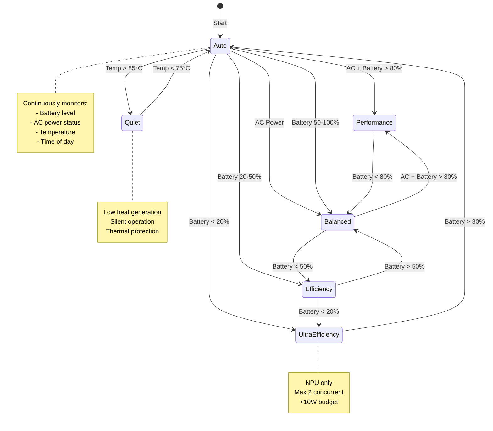

# Efficiency Modes

The Ollama Proxy provides **6 efficiency modes** that automatically configure routing behavior based on performance requirements, power constraints, thermal state, and system conditions.

---

## Overview

Efficiency modes provide pre-configured routing profiles that balance performance, power consumption, thermal output, and noise levels. Each mode optimizes the routing algorithm for specific use cases.

### Available Modes

| Mode | Power | Latency | Backends | Use Case |
|------|-------|---------|----------|----------|
| **Performance** | Max (55W) | Min (150ms) | NVIDIA → iGPU → NPU | AC power, speed priority |
| **Balanced** | Moderate (12W) | Moderate (400ms) | iGPU → NPU → NVIDIA | General usage |
| **Efficiency** | Low (3-12W) | High (800ms) | NPU → iGPU | Battery saving |
| **Quiet** | Low (3-12W) | High (800ms) | NPU → iGPU | Noise reduction |
| **Auto** | Adaptive | Adaptive | Dynamic | Automatic optimization |
| **Ultra Efficiency** | Minimal (3W) | Very High (800ms) | NPU only | Critical battery |

---

## Mode Details

### Performance Mode

**Goal:** Maximum speed, ignore power and thermal constraints

```yaml
mode: Performance
power_constraint: none
latency_preference: critical
backend_preference: [nvidia, igpu, npu, cpu]
thermal_threshold: 95°C (very high)
fan_noise_tolerance: high
```

**Routing Behavior:**
- **Primary:** NVIDIA GPU (55W, 150ms)
- **Fallback:** iGPU if NVIDIA congested
- **Last Resort:** NPU, CPU
- **Scoring weights:**
  - Latency: 3.0× multiplier
  - Power: 0.0× (ignored)
  - Queue depth: 1.0×

**Characteristics:**
- Latency: **150-200ms** (fastest)
- Power: **45-55W** (high)
- Fan Noise: **High** (GPU fans active)
- Battery Impact: **~18% per hour** of continuous use

**When to Use:**
- AC power available
- Performance demonstrations
- Benchmarking
- Time-critical workloads
- Rendering/encoding tasks

**Example:**
```bash
# Set Performance mode
curl -X POST http://localhost:8080/efficiency \
  -H "Content-Type: application/json" \
  -d '{"mode": "Performance"}'

# Verify
curl http://localhost:8080/efficiency
```

**Response:**
```json
{
  "mode": "Performance",
  "active_backends": ["ollama-nvidia", "ollama-igpu"],
  "power_budget_watts": null,
  "estimated_power_w": 55.0
}
```

---

### Balanced Mode

**Goal:** Balance between performance and power consumption

```yaml
mode: Balanced
power_constraint: moderate (prefer <20W)
latency_preference: normal
backend_preference: [igpu, nvidia, npu, cpu]
thermal_threshold: 85°C
fan_noise_tolerance: moderate
```

**Routing Behavior:**
- **Primary:** iGPU (12W, 400ms) - best balance
- **Performance Boost:** NVIDIA if iGPU congested and performance needed
- **Power Saving:** NPU if power efficiency requested
- **Scoring weights:**
  - Latency: 1.5×
  - Power efficiency: 1.0×
  - Queue depth: 1.5×

**Characteristics:**
- Latency: **300-500ms** (good)
- Power: **10-15W** (moderate)
- Fan Noise: **Low to Moderate**
- Battery Impact: **~4% per hour**

**When to Use:**
- General purpose computing
- Battery 50-80%
- Normal workloads
- Default for most users
- Desktop usage

**Example:**
```bash
curl -X POST http://localhost:8080/efficiency -d '{"mode": "Balanced"}'
```

---

### Efficiency Mode

**Goal:** Minimize power consumption, accept higher latency

```yaml
mode: Efficiency
power_constraint: strict (max 15W)
latency_preference: low
backend_preference: [npu, igpu]
thermal_threshold: 80°C
fan_noise_tolerance: low
```

**Routing Behavior:**
- **Primary:** NPU (3W, 800ms) - ultra efficient
- **Fallback:** iGPU (12W, 400ms) if NPU congested
- **Excluded:** NVIDIA (too power-hungry), CPU (inefficient)
- **Scoring weights:**
  - Power efficiency: 2.5×
  - Latency: 0.5×
  - Queue depth: 1.0×

**Characteristics:**
- Latency: **600-900ms** (acceptable)
- Power: **3-8W** (very low)
- Fan Noise: **Minimal** (fanless NPU)
- Battery Impact: **~1.5% per hour**

**When to Use:**
- Battery 20-50%
- Power saving priority
- Long inference sessions
- Background tasks
- All-day battery life target

**Example:**
```bash
curl -X POST http://localhost:8080/efficiency -d '{"mode": "Efficiency"}'
```

**Power Budget:**
```bash
# Efficiency mode automatically sets power budget
curl http://localhost:8080/efficiency

# Response shows:
{
  "mode": "Efficiency",
  "power_budget_watts": 15,
  "active_backends": ["ollama-npu", "ollama-igpu"]
}
```

---

### Quiet Mode

**Goal:** Minimize fan noise and thermal output

```yaml
mode: Quiet
power_constraint: strict (max 15W)
latency_preference: low
backend_preference: [npu, igpu]
thermal_threshold: 75°C (aggressive)
fan_noise_tolerance: minimal
```

**Routing Behavior:**
- **Primary:** NPU (3W, passive cooling)
- **Fallback:** iGPU (12W, low fan speeds)
- **Excluded:** NVIDIA (loud fans), CPU (moderate fans)
- **Additional:** Monitor temperature, switch to NPU if temp >75°C

**Characteristics:**
- Latency: **600-900ms** (same as Efficiency)
- Power: **3-8W** (very low heat)
- Fan Noise: **Silent to Very Quiet**
- Thermal: **Minimal heat generation**

**When to Use:**
- Quiet environments (library, meetings, night)
- Recording audio/video
- Noise-sensitive applications
- Thermal throttling prevention
- Fanless operation desired

**Example:**
```bash
# Set Quiet mode
curl -X POST http://localhost:8080/efficiency -d '{"mode": "Quiet"}'

# Mode will monitor temperature and stay quiet
```

**Difference from Efficiency Mode:**
- **Efficiency:** Optimizes power, accepts moderate fan noise
- **Quiet:** Optimizes noise, aggressively avoids fan activation

---

### Auto Mode

**Goal:** Automatically adapt to system conditions

```yaml
mode: Auto
power_constraint: dynamic
latency_preference: adaptive
backend_preference: dynamic
thermal_threshold: 85°C
decision_factors:
  - battery_level
  - ac_power_status
  - thermal_state
  - time_of_day
  - user_activity
```

**Auto Mode Decision Logic:**

```go
func (em *EfficiencyManager) autoModeSelect() Mode {
    state := em.getSystemState()

    // Critical battery
    if state.BatteryLevel < 20 && state.OnBattery {
        return EfficiencyUltraEfficiency
    }

    // Thermal event
    if state.CPUTemp > 85 || state.GPUTemp > 85 {
        return EfficiencyQuiet
    }

    // AC power + good battery
    if !state.OnBattery && state.BatteryLevel > 80 {
        return EfficiencyPerformance
    }

    // AC power + charging
    if !state.OnBattery {
        return EfficiencyBalanced
    }

    // Battery 50-100%
    if state.BatteryLevel >= 50 {
        return EfficiencyBalanced
    }

    // Battery 20-50%
    return EfficiencyEfficiency
}
```

**Auto Mode State Machine:**



**Auto Mode Transitions:**

```
State Change → Mode Transition
────────────────────────────────────────────
AC Connected → Balanced (if battery <80%)
             → Performance (if battery ≥80%)

AC Disconnected → Balanced (if battery ≥50%)
                → Efficiency (if battery <50%)

Battery <20% → Ultra Efficiency

Temp >85°C → Quiet

Temp <75°C → Return to power-based mode

Quiet Hours (22:00-07:00) → Quiet
```

**Example:**
```bash
# Set Auto mode (recommended)
curl -X POST http://localhost:8080/efficiency -d '{"mode": "Auto"}'

# Watch mode changes
journalctl --user -u ie.fio.ollamaproxy.service -f | grep "EfficiencyMode"
```

**Benefits:**
- **Zero configuration:** Set once, works for all scenarios
- **Battery optimization:** Extends battery life automatically
- **Thermal protection:** Prevents overheating
- **Quiet hours:** Reduces noise at night
- **Performance when available:** Uses NVIDIA when on AC power

**Recommended:** Use Auto mode unless you have specific requirements.

---

### Ultra Efficiency Mode

**Goal:** Maximum battery life, minimal power consumption

```yaml
mode: UltraEfficiency
power_constraint: maximum (max 10W)
latency_preference: none (accept any latency)
backend_preference: [npu]
thermal_threshold: 75°C
concurrency_limit: 2
```

**Routing Behavior:**
- **Only:** NPU (3W, 800ms)
- **Excluded:** All other backends
- **Concurrency:** Max 2 simultaneous requests
- **Aggressive:** Closes idle connections, minimal overhead

**Characteristics:**
- Latency: **800-1000ms** (slowest)
- Power: **3-5W** (absolute minimum)
- Fan Noise: **Silent** (fanless NPU)
- Battery Impact: **~1% per hour** (minimal)

**When to Use:**
- Battery <20% (critical)
- No AC power available soon
- Multi-hour sessions required
- Emergency battery saving
- Mobile/embedded devices

**Example:**
```bash
# Manual activation
curl -X POST http://localhost:8080/efficiency -d '{"mode": "UltraEfficiency"}'

# Auto mode activates automatically at battery <20%
```

**Trade-offs:**
- **Gain:** 10-15 hours of inference on single charge
- **Loss:** 5-7× slower than Performance mode
- **Acceptable for:** Background tasks, batch processing, non-interactive workloads

---

## Mode Comparison

### Performance vs Power

```
Workload: 100 chat completions (average 20 tokens each)

Performance Mode:
  Time: 15 seconds total
  Power: 55W average
  Energy: 0.23 Wh
  Battery: -4.6%
  Fan: Loud (3500 RPM)

Balanced Mode:
  Time: 40 seconds total
  Power: 12W average
  Energy: 0.13 Wh
  Battery: -2.6%
  Fan: Moderate (2000 RPM)

Efficiency Mode:
  Time: 80 seconds total
  Power: 3W average
  Energy: 0.07 Wh
  Battery: -1.4%
  Fan: Silent (0 RPM)

Ultra Efficiency Mode:
  Time: 85 seconds total
  Power: 3W average
  Energy: 0.07 Wh
  Battery: -1.4%
  Fan: Silent (0 RPM)
  Concurrency: Limited
```

### Recommended Mode by Use Case

| Use Case | Best Mode | Rationale |
|----------|-----------|-----------|
| Interactive chat | Balanced | Good latency, reasonable power |
| Voice transcription | Performance | Low latency critical |
| Document summarization | Efficiency | Batch workload, power saving |
| Live demo | Performance | Show best performance |
| All-day usage | Auto | Adapts to conditions |
| Library/quiet space | Quiet | Minimal noise |
| Battery <20% | Ultra Efficiency | Extend battery life |
| Benchmark testing | Performance | Maximum speed |
| Background tasks | Efficiency | Power saving |

---

## Configuration

### Set Mode via HTTP API

```bash
# Set mode
curl -X POST http://localhost:8080/efficiency \
  -H "Content-Type: application/json" \
  -d '{"mode": "Balanced"}'

# Get current mode
curl http://localhost:8080/efficiency
```

**Response:**
```json
{
  "mode": "Balanced",
  "active_backends": ["ollama-igpu", "ollama-nvidia", "ollama-npu"],
  "power_budget_watts": 20,
  "estimated_latency_ms": 400,
  "system_state": {
    "on_battery": false,
    "battery_level": 85,
    "cpu_temp_c": 68.0
  }
}
```

### Set Mode via D-Bus

```bash
# Set mode
busctl --user call ie.fio.OllamaProxy.Efficiency \
  /ie/fio/OllamaProxy/Efficiency \
  ie.fio.OllamaProxy.Efficiency \
  SetEfficiencyMode s "Performance"

# Get current mode
busctl --user call ie.fio.OllamaProxy.Efficiency \
  /ie/fio/OllamaProxy/Efficiency \
  ie.fio.OllamaProxy.Efficiency \
  GetEfficiencyMode
```

### Set Mode via GNOME Extension

1. Click **Quick Settings** (top-right panel)
2. Find **"AI Efficiency"** toggle
3. Select mode from dropdown:
   - Performance
   - Balanced
   - Efficiency
   - Quiet
   - Auto
   - Ultra Efficiency

**Visual indicator:** Icon changes based on mode:
- ⚡ Performance
- ⚖️ Balanced
- 🔋 Efficiency
- 🔇 Quiet
- 🔄 Auto
- 🪫 Ultra Efficiency

### Configure Mode Behavior

Customize mode parameters in `config/config.yaml`:

```yaml
efficiency_modes:
  performance:
    power_budget_watts: null       # No limit
    latency_weight: 3.0
    power_weight: 0.0
    backend_preference: ["nvidia", "igpu", "npu"]

  balanced:
    power_budget_watts: 20
    latency_weight: 1.5
    power_weight: 1.0
    backend_preference: ["igpu", "nvidia", "npu"]

  efficiency:
    power_budget_watts: 15
    latency_weight: 0.5
    power_weight: 2.5
    backend_preference: ["npu", "igpu"]

  quiet:
    power_budget_watts: 15
    latency_weight: 0.5
    power_weight: 2.0
    thermal_aggressive: true
    backend_preference: ["npu", "igpu"]

  ultra_efficiency:
    power_budget_watts: 10
    latency_weight: 0.0
    power_weight: 3.0
    backend_preference: ["npu"]
    max_concurrency: 2

  auto:
    enabled: true
    battery_thresholds:
      ultra_efficiency: 20
      efficiency: 50
      balanced: 80
    thermal_threshold: 85
    quiet_hours:
      enabled: true
      start_hour: 22  # 10 PM
      end_hour: 7     # 7 AM
```

---

## Monitoring Mode Changes

### Log Mode Transitions

Watch efficiency mode changes in real-time:

```bash
journalctl --user -u ie.fio.ollamaproxy.service -f | grep "EfficiencyMode"
```

**Example log output:**
```
[EfficiencyMode] Mode changed: Balanced → Efficiency (reason: battery_level_45%)
[EfficiencyMode] Active backends: [ollama-npu, ollama-igpu]
[EfficiencyMode] Power budget: 15W
[EfficiencyMode] Mode changed: Efficiency → Quiet (reason: thermal_event_87C)
[EfficiencyMode] Mode changed: Quiet → Balanced (reason: temperature_normalized)
```

### Mode Change Events

D-Bus emits signals on mode change:

```bash
# Listen for mode change signals
dbus-monitor --session "type='signal',interface='ie.fio.OllamaProxy.Efficiency'"
```

**Signal format:**
```
signal sender=:1.123 -> dest=(null destination) serial=42 path=/ie/fio/OllamaProxy/Efficiency; interface=ie.fio.OllamaProxy.Efficiency; member=ModeChanged
   string "Balanced"
   string "Efficiency"
   string "battery_level_42%"
```

### Query Mode History

Track mode usage statistics:

```bash
# Get mode change history (last 24 hours)
curl http://localhost:8080/efficiency/history

# Response:
{
  "period_hours": 24,
  "mode_usage": {
    "Auto": "18h 30m (77%)",
    "Efficiency": "4h 15m (18%)",
    "Quiet": "1h 15m (5%)"
  },
  "transitions": 12,
  "reasons": {
    "battery_level": 7,
    "thermal_event": 3,
    "ac_disconnected": 2
  }
}
```

---

## Integration Examples

### Python Client with Auto Mode

```python
import requests

class ProxyClient:
    def __init__(self, base_url="http://localhost:8080"):
        self.base_url = base_url

    def set_mode(self, mode):
        """Set efficiency mode"""
        response = requests.post(
            f"{self.base_url}/efficiency",
            json={"mode": mode}
        )
        return response.json()

    def get_mode(self):
        """Get current efficiency mode"""
        response = requests.get(f"{self.base_url}/efficiency")
        return response.json()

    def generate(self, prompt, model="qwen2.5:0.5b"):
        """Generate completion (respects current mode)"""
        response = requests.post(
            f"{self.base_url}/v1/chat/completions",
            json={
                "model": model,
                "messages": [{"role": "user", "content": prompt}]
            }
        )

        # Check which backend was used
        backend = response.headers.get("X-Backend-Used")
        power = response.headers.get("X-Estimated-Power-W")
        print(f"Backend: {backend}, Power: {power}W")

        return response.json()

# Usage
client = ProxyClient()

# Set Auto mode
client.set_mode("Auto")

# Mode adapts automatically based on system state
result = client.generate("Explain quantum computing")
```

### Bash Script for Battery-Aware Operation

```bash
#!/bin/bash
# Smart mode selection based on battery

get_battery_level() {
    cat /sys/class/power_supply/BAT0/capacity
}

set_appropriate_mode() {
    battery=$(get_battery_level)

    if [ $battery -lt 20 ]; then
        mode="UltraEfficiency"
    elif [ $battery -lt 50 ]; then
        mode="Efficiency"
    else
        mode="Balanced"
    fi

    echo "Battery: ${battery}%, Setting mode: $mode"
    curl -X POST http://localhost:8080/efficiency -d "{\"mode\": \"$mode\"}"
}

# Set mode before batch job
set_appropriate_mode

# Run inference workload
for doc in documents/*.txt; do
    curl -X POST http://localhost:8080/v1/chat/completions \
        -d "{\"model\": \"qwen2.5:0.5b\", \"messages\": [{\"role\": \"user\", \"content\": \"Summarize: $(cat $doc)\"}]}"
done
```

### systemd Service with Auto Mode

```ini
# ~/.config/systemd/user/ai-batch-job.service
[Unit]
Description=AI Batch Processing Job
After=ie.fio.ollamaproxy.service

[Service]
Type=oneshot
ExecStartPre=/usr/bin/curl -X POST http://localhost:8080/efficiency -d '{"mode": "Efficiency"}'
ExecStart=/home/user/scripts/batch-inference.sh
ExecStopPost=/usr/bin/curl -X POST http://localhost:8080/efficiency -d '{"mode": "Auto"}'

[Install]
WantedBy=default.target
```

---

## Best Practices

### 1. Use Auto Mode as Default

Set Auto mode and let it handle optimization:

```bash
curl -X POST http://localhost:8080/efficiency -d '{"mode": "Auto"}'
```

Benefits:
- Automatic battery saving
- Thermal protection
- Performance when available
- Zero maintenance

### 2. Override for Specific Workloads

Use specific modes for known workloads:

```bash
# Before performance demo
curl -X POST http://localhost:8080/efficiency -d '{"mode": "Performance"}'

# Before all-day batch job
curl -X POST http://localhost:8080/efficiency -d '{"mode": "Efficiency"}'

# After completion, return to Auto
curl -X POST http://localhost:8080/efficiency -d '{"mode": "Auto"}'
```

### 3. Monitor Mode Changes

Track why modes are changing:

```bash
# Enable detailed logging
journalctl --user -u ie.fio.ollamaproxy.service -f | grep -E "(EfficiencyMode|Thermal|Battery)"
```

### 4. Profile Your Workload

Understand mode impact for your specific use case:

```bash
#!/bin/bash
# Profile all modes

for mode in Performance Balanced Efficiency UltraEfficiency; do
    echo "Testing $mode..."

    # Set mode
    curl -X POST http://localhost:8080/efficiency -d "{\"mode\": \"$mode\"}"

    # Run 10 requests, measure time
    start=$(date +%s)
    for i in {1..10}; do
        curl -s http://localhost:8080/v1/chat/completions \
            -d '{"model": "qwen2.5:0.5b", "messages": [{"role": "user", "content": "Test"}]}' > /dev/null
    done
    end=$(date +%s)

    duration=$((end - start))
    echo "$mode: ${duration}s for 10 requests"
done
```

### 5. Document Mode Requirements

For applications, document recommended mode:

```python
# myapp/config.py

# Recommended efficiency mode for this application
RECOMMENDED_MODE = "Balanced"  # Interactive chat requires reasonable latency

# Set on startup
def setup_inference():
    requests.post(
        "http://localhost:8080/efficiency",
        json={"mode": RECOMMENDED_MODE}
    )
```

---

## Troubleshooting

### Mode Not Changing

**Symptoms:**
- Mode set via API but routing behavior unchanged

**Check:**
```bash
# Verify mode was set
curl http://localhost:8080/efficiency

# Check if Auto mode is overriding
# Auto mode may switch back based on system state
```

**Solution:**
- If using Auto mode, it will override manual settings based on system state
- Set explicit mode and verify Auto is disabled

### Unexpected Performance in Efficiency Mode

**Symptoms:**
- Efficiency mode set but fast response times (unexpected)

**Possible cause:** NPU backend performing better than expected

**Check:**
```bash
# Verify backend used
curl -i http://localhost:8080/v1/chat/completions \
    -d '{"model": "qwen2.5:0.5b", "messages": [...]}'

# Look for header: X-Backend-Used
# Should be: ollama-npu
```

**If unexpected backend:**
- Check if NPU is healthy
- Verify power budget not excluding NPU

### Auto Mode Not Switching

**Symptoms:**
- Battery level changed but mode didn't switch

**Debug:**
```bash
# Check Auto mode decision logic
curl http://localhost:8080/efficiency

# Check system state
curl http://localhost:8080/thermal
curl http://localhost:8080/backends | jq '.[] | {id: .id, healthy: .health.healthy}'

# Check logs for Auto mode decisions
journalctl --user -u ie.fio.ollamaproxy.service | grep "AutoMode"
```

**Common issues:**
- System state monitor not running
- Battery state not detected (desktop systems)
- Thermal sensors not available

---

## Related Documentation

- [Power Management](power-management.md) - Power-aware routing details
- [Thermal Monitoring](thermal-monitoring.md) - Thermal event handling
- [Multi-Backend Routing](routing.md) - Routing algorithm
- [GNOME Integration](../guides/gnome-integration.md) - Desktop integration
