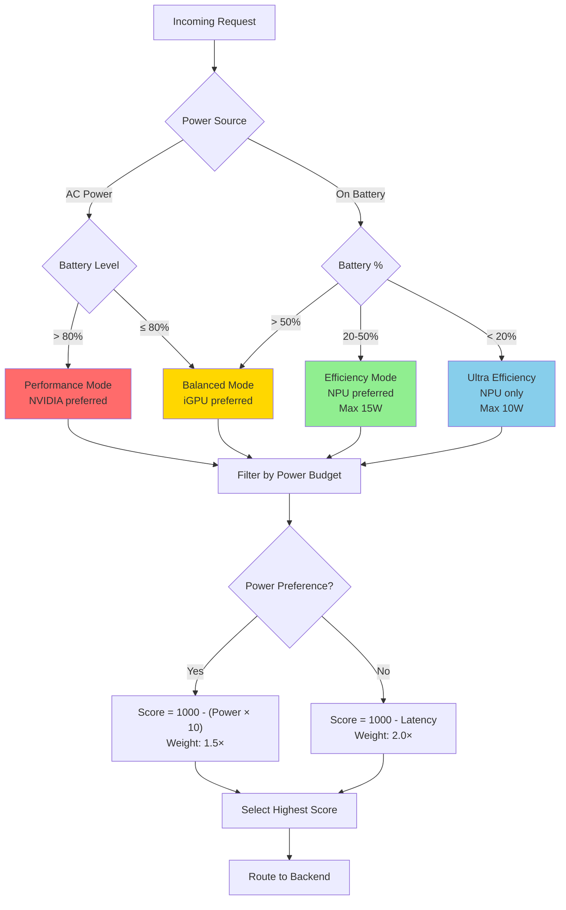

# Power-Aware Routing

The Ollama Proxy implements **intelligent power-aware routing** that optimizes inference workload distribution based on power consumption, battery level, AC power status, and efficiency mode settings.

---

## Overview

Power-aware routing solves the challenge of running AI inference on battery-powered devices by intelligently selecting backends based on their power consumption characteristics, ranging from ultra-efficient NPU (3W) to high-performance GPU (55W).

### Backend Power Profiles

| Backend | Power (Watts) | Latency (ms) | Use Case |
|---------|---------------|--------------|----------|
| NPU | 3W | 800ms | Battery mode, background tasks |
| iGPU | 12W | 400ms | Balanced mode |
| NVIDIA RTX 4060 | 55W | 150ms | AC power, performance mode |
| CPU | 28W | 2000ms | Fallback only |

---

## Power-Aware Features

### Power-Aware Routing Decision Tree



### 1. Battery State Detection

The proxy monitors system power state via UPower D-Bus service:

```go
// Monitor battery level and AC status
systemState := monitor.GetSystemState()

if systemState.OnBattery {
    // Prefer power-efficient backends
    annotations.PreferPowerEfficiency = true
}

if systemState.BatteryLevel < 20 {
    // Critical battery: Ultra-efficient mode
    annotations.MaxPowerWatts = 10
}
```

**Automatic Behavior:**
- **AC Power:** Routes to fastest backends (NVIDIA GPU)
- **Battery >50%:** Balanced routing (iGPU)
- **Battery 20-50%:** Power-efficient routing (NPU preferred)
- **Battery <20%:** Ultra-efficient mode (NPU only, max 10W)

### 2. Power Budget Constraints

Clients can specify maximum power budget via HTTP header:

```bash
# Limit to 15W (excludes NVIDIA 55W, CPU 28W)
curl http://localhost:8080/v1/chat/completions \
  -H "X-Max-Power-Watts: 15" \
  -d '{"model": "qwen2.5:0.5b", "messages": [...]}'

# Ultra-low power (NPU only)
curl http://localhost:8080/v1/chat/completions \
  -H "X-Max-Power-Watts: 5" \
  -d '{"model": "qwen2.5:0.5b", "messages": [...]}'
```

**Routing Decision:**
- Backends exceeding power budget are **filtered out**
- Remaining backends scored normally
- Best backend within budget selected

### 3. Power-Efficiency Preference

Request explicit power-efficient routing:

```bash
curl http://localhost:8080/v1/chat/completions \
  -H "X-Power-Efficient: true" \
  -d '{"model": "qwen2.5:0.5b", "messages": [...]}'
```

**Routing Impact:**
```go
// Power efficiency scoring
if annotations.PreferPowerEfficiency {
    powerScore := 1000.0 - (backend.PowerWatts() * 10)
    score += powerScore * 1.5  // Weight power efficiency heavily
}
```

**Example Scores:**
- NPU (3W): 1000 - 30 = **970 points** × 1.5 = **1455**
- iGPU (12W): 1000 - 120 = **880 points** × 1.5 = **1320**
- NVIDIA (55W): 1000 - 550 = **450 points** × 1.5 = **675**

Result: NPU strongly preferred when power-efficiency requested.

---

## Efficiency Modes

The proxy supports 6 efficiency modes that automatically configure power-aware routing:

### Auto Mode (Default)

Automatically adjusts based on system state:

```yaml
# Auto mode behavior
AC Power + Battery >80%:  → Performance mode
AC Power + Battery <80%:  → Balanced mode
Battery 50-100%:          → Balanced mode
Battery 20-50%:           → Efficiency mode
Battery <20%:             → Ultra Efficiency mode
High temperature (>80°C): → Quiet mode
```

**Configuration:**
```bash
# Set via HTTP API
curl -X POST http://localhost:8080/efficiency \
  -H "Content-Type: application/json" \
  -d '{"mode": "Auto"}'

# Set via D-Bus
busctl --user call ie.fio.OllamaProxy.Efficiency \
  /ie/fio/OllamaProxy/Efficiency \
  ie.fio.OllamaProxy.Efficiency \
  SetEfficiencyMode s "Auto"
```

### Performance Mode

Maximum performance, ignore power consumption:

```yaml
mode: Performance
power_constraint: none
latency_preference: critical
preferred_backends: [nvidia, igpu, npu]
```

**Routing Behavior:**
- Routes to fastest backends (NVIDIA preferred)
- No power budget constraints
- Latency optimization maximized

**Use Cases:**
- AC power available
- Rendering/encoding tasks
- Interactive demos
- Performance benchmarking

### Balanced Mode

Balance between power and performance:

```yaml
mode: Balanced
power_constraint: moderate (prefer <20W)
latency_preference: normal
preferred_backends: [igpu, npu, nvidia]
```

**Routing Behavior:**
- Prefers iGPU (12W, 400ms) - good balance
- Uses NVIDIA only if iGPU congested
- Moderate latency optimization

**Use Cases:**
- General usage
- Battery 50-80%
- Normal workloads

### Efficiency Mode

Minimize power consumption:

```yaml
mode: Efficiency
power_constraint: strict (max 15W)
latency_preference: low
preferred_backends: [npu, igpu]
```

**Routing Behavior:**
- NPU strongly preferred (3W)
- iGPU as fallback (12W)
- NVIDIA and CPU excluded (too power-hungry)

**Use Cases:**
- Battery 20-50%
- Power saving mode
- Background tasks
- All-day battery life

### Quiet Mode

Minimize fan noise and temperature:

```yaml
mode: Quiet
power_constraint: strict (max 15W)
temperature_preference: low
preferred_backends: [npu, igpu]
fan_speed_target: <30%
```

**Routing Behavior:**
- Routes to low-power backends (reduce heat)
- Avoids high-power backends (loud fans)
- Monitors thermal state

**Use Cases:**
- Quiet environments (library, meetings)
- Thermal throttling detected
- Fan noise reduction
- Night usage

### Ultra Efficiency Mode

Extreme power saving:

```yaml
mode: UltraEfficiency
power_constraint: maximum (max 10W)
latency_preference: none
preferred_backends: [npu]
```

**Routing Behavior:**
- **NPU only** (3W)
- All other backends excluded
- Accept higher latency (800ms)

**Use Cases:**
- Battery <20%
- Critical battery saving
- Multi-hour inference sessions
- Mobile/embedded devices

---

## Power-Aware Routing Scenarios

### Scenario 1: AC Power → Battery Transition

**Initial State (AC Power):**
```
System: AC powered, battery 100%
Mode: Performance
Backend: NVIDIA GPU (55W, 150ms)
```

**User unplugs laptop:**
```
Event: AC disconnected
Auto Mode Action:
  1. Detect battery power
  2. Switch to Balanced mode
  3. Set power preference: moderate
  4. Route new requests to iGPU (12W, 400ms)

Result: ~4x power reduction, 2.5x latency increase (acceptable)
```

**Logs:**
```
[PowerMonitor] AC disconnected, battery: 98%
[EfficiencyMode] Auto mode: AC → Battery, switching Performance → Balanced
[Routing] New requests route to ollama-igpu (12W) instead of ollama-nvidia (55W)
```

### Scenario 2: Battery Drain to Critical

**Battery levels and routing changes:**

```
Battery 80% → AC mode routing (balanced)
  Backend: iGPU (12W)

Battery 50% → Efficiency mode
  Backend: NPU (3W)
  Mode switch logged

Battery 20% → Ultra Efficiency mode
  Backend: NPU only
  Max power: 10W hard limit
  Notification: "Low battery, entering power saving mode"

Battery 10% → Critical
  Backend: NPU (3W)
  Reduce concurrent requests
  Notification: "Critical battery, AI performance reduced"
```

### Scenario 3: Explicit Power Budget

**Request with 15W budget:**

```bash
curl http://localhost:8080/v1/chat/completions \
  -H "X-Max-Power-Watts: 15" \
  -d '{"model": "qwen2.5:0.5b", "messages": [...]}'
```

**Routing Decision:**
1. Filter backends by power:
   - ✅ NPU (3W) - within budget
   - ✅ iGPU (12W) - within budget
   - ❌ NVIDIA (55W) - exceeds budget
   - ❌ CPU (28W) - exceeds budget

2. Score remaining backends:
   - iGPU: Higher performance (400ms vs 800ms)
   - NPU: Lower power (3W vs 12W)

3. If power-efficient preference: NPU
4. If balanced/performance: iGPU

**Response Headers:**
```
X-Backend-Used: ollama-igpu
X-Estimated-Power-W: 12.0
X-Routing-Reason: power-budget-12W
X-Alternatives: ollama-npu
```

### Scenario 4: Thermal Event → Power Reduction

**High temperature detected:**

```
Event: GPU temperature > 85°C
Thermal Monitor Action:
  1. Detect thermal throttling
  2. Auto switch to Quiet mode
  3. Route to NPU (low power, low heat)

Result: Temperature drops, fan noise reduces
```

**Logs:**
```
[ThermalMonitor] GPU temp: 87°C (threshold: 85°C)
[ThermalMonitor] Thermal event: switching to Quiet mode
[Routing] Routing new requests to ollama-npu (3W) to reduce thermal load
```

---

## Power Monitoring

### Real-Time Power Stats

Query current power consumption:

```bash
# HTTP API
curl http://localhost:8080/backends | jq '.[] | {id: .id, power_watts: .power_watts, active: .health.healthy}'
```

**Example output:**
```json
[
  {
    "id": "ollama-npu",
    "power_watts": 3.0,
    "active": true
  },
  {
    "id": "ollama-igpu",
    "power_watts": 12.0,
    "active": true
  },
  {
    "id": "ollama-nvidia",
    "power_watts": 55.0,
    "active": false
  }
]
```

### Battery State

Query battery level and AC status:

```bash
# D-Bus API
busctl --user call ie.fio.OllamaProxy.SystemState \
  /ie/fio/OllamaProxy/SystemState \
  ie.fio.OllamaProxy.SystemState \
  GetBatteryState
```

**Response:**
```json
{
  "battery_level": 45,
  "on_battery": true,
  "time_remaining_minutes": 180
}
```

### Power Usage Trends

Track power consumption over time:

```bash
# Log power usage every 10 seconds
while true; do
  curl -s http://localhost:8080/backends | \
    jq -r '.[] | select(.health.healthy) | "\(.id): \(.power_watts)W"'
  sleep 10
done
```

**Example output:**
```
ollama-npu: 3.0W
ollama-igpu: 12.0W

[After mode switch to Efficiency]
ollama-npu: 3.0W
```

---

## Configuration

### Backend Power Characteristics

Define power consumption in backend configuration:

```yaml
backends:
  - id: ollama-npu
    characteristics:
      power_watts: 3.0
      avg_latency_ms: 800

  - id: ollama-igpu
    characteristics:
      power_watts: 12.0
      avg_latency_ms: 400

  - id: ollama-nvidia
    characteristics:
      power_watts: 55.0
      avg_latency_ms: 150
```

### Router Power Settings

Configure power-aware routing behavior:

```yaml
router:
  power_aware: true              # Enable power-aware routing
  auto_optimize: true            # Enable auto mode optimization

  # Power budget thresholds
  battery_thresholds:
    critical: 20                 # Ultra efficiency below 20%
    low: 50                      # Efficiency mode below 50%
    moderate: 80                 # Balanced mode below 80%

  # Power scoring weights
  power_efficiency_weight: 1.5   # Weight for power-efficient preference
  latency_weight: 2.0            # Weight for latency optimization
```

### Auto Mode Behavior

Customize auto mode switching:

```yaml
efficiency_modes:
  auto:
    ac_performance_threshold: 80     # Battery % for performance on AC
    battery_balanced_threshold: 50   # Battery % for balanced mode
    battery_efficiency_threshold: 20 # Battery % for efficiency mode
    thermal_quiet_threshold: 80      # Temperature °C for quiet mode
```

---

## Best Practices

### 1. Use Auto Mode for Laptops

Auto mode handles AC/battery transitions automatically:

```bash
# Set once, forget it
curl -X POST http://localhost:8080/efficiency \
  -d '{"mode": "Auto"}'
```

### 2. Set Power Budgets for Battery-Critical Apps

For apps running on battery, set explicit power budget:

```python
import requests

def battery_aware_request(prompt):
    # Check battery level
    battery = get_battery_level()

    if battery < 20:
        max_power = 5  # Ultra low
    elif battery < 50:
        max_power = 15  # Moderate
    else:
        max_power = None  # No limit

    headers = {}
    if max_power:
        headers["X-Max-Power-Watts"] = str(max_power)

    return requests.post(
        "http://localhost:8080/v1/chat/completions",
        headers=headers,
        json={"model": "qwen2.5:0.5b", "messages": [{"role": "user", "content": prompt}]}
    )
```

### 3. Monitor Power Consumption

Track actual vs estimated power:

```bash
# Compare estimated power to actual system power draw
watch -n 5 'echo "Estimated: $(curl -s http://localhost:8080/backends | jq ".[] | select(.health.healthy) | .power_watts")W"; echo "Actual: $(cat /sys/class/power_supply/BAT0/power_now | awk "{print \$1/1000000}")W"'
```

### 4. Use Quiet Mode in Meetings

Reduce fan noise during quiet environments:

```bash
# Before meeting
curl -X POST http://localhost:8080/efficiency -d '{"mode": "Quiet"}'

# After meeting
curl -X POST http://localhost:8080/efficiency -d '{"mode": "Auto"}'
```

### 5. Profile Power Consumption

Benchmark power usage for your workload:

```bash
#!/bin/bash
# Power profiling script

for mode in Performance Balanced Efficiency UltraEfficiency; do
  echo "Testing $mode mode..."

  # Set mode
  curl -X POST http://localhost:8080/efficiency -d "{\"mode\": \"$mode\"}"

  # Run 100 requests
  start_power=$(cat /sys/class/power_supply/BAT0/power_now)
  for i in {1..100}; do
    curl -s http://localhost:8080/v1/chat/completions \
      -d '{"model": "qwen2.5:0.5b", "messages": [{"role": "user", "content": "Hello"}]}' > /dev/null
  done
  end_power=$(cat /sys/class/power_supply/BAT0/power_now)

  avg_power=$(echo "($start_power + $end_power) / 2000000" | bc -l)
  echo "$mode: ${avg_power}W average"
done
```

---

## Troubleshooting

### High Power Consumption on Battery

**Symptoms:**
- Battery draining fast
- Routing to NVIDIA GPU on battery

**Check:**
```bash
# Verify efficiency mode
curl http://localhost:8080/efficiency

# Check if auto mode is enabled
# Expected on battery: Efficiency or UltraEfficiency mode
```

**Solution:**
```bash
# Force efficiency mode
curl -X POST http://localhost:8080/efficiency -d '{"mode": "Efficiency"}'
```

### NPU Not Being Used

**Symptoms:**
- Power-efficient mode set but iGPU used instead of NPU

**Check:**
```bash
# Verify NPU backend is healthy
curl http://localhost:8080/backends | jq '.[] | select(.id=="ollama-npu") | .health'
```

**Possible Causes:**
1. NPU backend unhealthy
2. Model not supported by NPU
3. Latency constraint excluding NPU

**Solution:**
```bash
# Explicitly target NPU
curl http://localhost:8080/v1/chat/completions \
  -H "X-Target-Backend: ollama-npu" \
  -d '{"model": "qwen2.5:0.5b", "messages": [...]}'
```

### Mode Not Switching Automatically

**Symptoms:**
- AC disconnected but still in Performance mode

**Check:**
```bash
# Verify auto mode enabled
curl http://localhost:8080/efficiency
# Should show: "mode": "Auto"

# Check system state detection
busctl --user call ie.fio.OllamaProxy.SystemState \
  /ie/fio/OllamaProxy/SystemState \
  ie.fio.OllamaProxy.SystemState \
  GetBatteryState
```

**Solution:**
```bash
# Restart power monitor
systemctl --user restart ie.fio.ollamaproxy.service
```

---

## Integration Examples

### GNOME Extension

The GNOME Shell extension provides quick access to efficiency modes:

1. Click **Quick Settings** (top-right panel)
2. Find **"AI Efficiency"** toggle
3. Select mode: Performance, Balanced, Efficiency, Quiet, Auto, Ultra Efficiency

**Extension Features:**
- Visual mode indicator
- Backend status display
- Power consumption estimate
- Battery level integration

### Python Power-Aware Client

```python
import requests
import psutil

class PowerAwareClient:
    def __init__(self, base_url="http://localhost:8080"):
        self.base_url = base_url

    def get_battery_level(self):
        battery = psutil.sensors_battery()
        if battery:
            return battery.percent, not battery.power_plugged
        return 100, False  # Assume AC if no battery

    def generate(self, prompt, model="qwen2.5:0.5b"):
        battery_level, on_battery = self.get_battery_level()

        headers = {}

        if on_battery:
            if battery_level < 20:
                headers["X-Max-Power-Watts"] = "5"
                headers["X-Power-Efficient"] = "true"
            elif battery_level < 50:
                headers["X-Max-Power-Watts"] = "15"
                headers["X-Power-Efficient"] = "true"
            else:
                headers["X-Power-Efficient"] = "true"

        response = requests.post(
            f"{self.base_url}/v1/chat/completions",
            headers=headers,
            json={
                "model": model,
                "messages": [{"role": "user", "content": prompt}]
            }
        )

        backend_used = response.headers.get("X-Backend-Used")
        power_used = response.headers.get("X-Estimated-Power-W")
        print(f"Backend: {backend_used}, Power: {power_used}W")

        return response.json()

# Usage
client = PowerAwareClient()
result = client.generate("Explain quantum computing")
```

---

## Performance vs Power Tradeoffs

### Latency vs Power

| Mode | Backend | Latency | Power | Battery Life Impact |
|------|---------|---------|-------|---------------------|
| Performance | NVIDIA | 150ms | 55W | -18% per hour |
| Balanced | iGPU | 400ms | 12W | -4% per hour |
| Efficiency | NPU | 800ms | 3W | -1% per hour |
| Ultra Efficiency | NPU | 800ms | 3W | -1% per hour |

**Example:** 100 inferences per hour

- **Performance mode:** 15 seconds total, 55W usage = ~0.9Wh, 18% battery drain
- **Efficiency mode:** 80 seconds total, 3W usage = ~0.07Wh, 1.4% battery drain

**Tradeoff:** 5.3x slower, 13x more battery life

---

## Related Documentation

- [Multi-Backend Routing](routing.md) - Routing algorithm details
- [Efficiency Modes](efficiency-modes.md) - Complete efficiency mode guide
- [Thermal Monitoring](thermal-monitoring.md) - Temperature-based power management
- [GNOME Integration](../guides/gnome-integration.md) - Desktop integration
