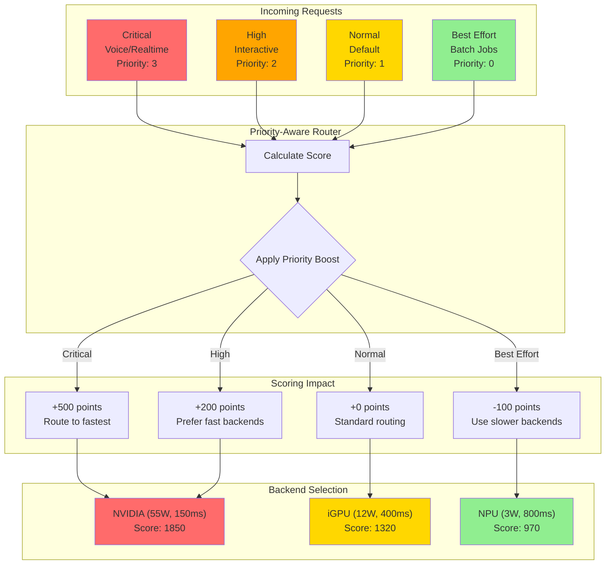

# Priority Queuing

The Ollama Proxy implements a **4-level priority queuing system** that ensures critical workloads (voice, realtime) get priority routing and resource allocation, while batch jobs run efficiently in the background.

---

## Overview

Priority queuing solves the problem of **head-of-line blocking** where low-priority batch jobs can delay high-priority realtime requests. The system combines priority levels with queue-aware routing to ensure predictable latency for critical workloads.

### Priority Levels

| Level | Name | Value | Use Cases | Example Workloads |
|-------|------|-------|-----------|-------------------|
| 0 | Best Effort | `PriorityBestEffort` | Background tasks, batch processing | Document summarization, bulk processing |
| 1 | Normal | `PriorityNormal` | Default requests | General chat, Q&A |
| 2 | High | `PriorityHigh` | Important workloads | Interactive chat, important queries |
| 3 | Critical | `PriorityCritical` | Realtime streams | Voice transcription, live chat |

---

## How It Works

### Priority Routing Flow



### 1. Request Annotation

Requests are annotated with priority level via HTTP header:

```bash
# Critical priority (voice/realtime)
curl http://localhost:8080/v1/chat/completions \
  -H "X-Priority: critical" \
  -d '{"model": "qwen2.5:0.5b", "messages": [...]}'

# High priority (interactive)
curl http://localhost:8080/v1/chat/completions \
  -H "X-Priority: high" \
  -d '{"model": "qwen2.5:0.5b", "messages": [...]}'

# Normal priority (default, can be omitted)
curl http://localhost:8080/v1/chat/completions \
  -d '{"model": "qwen2.5:0.5b", "messages": [...]}'

# Best effort (batch)
curl http://localhost:8080/v1/chat/completions \
  -H "X-Priority: best-effort" \
  -d '{"model": "qwen2.5:0.5b", "messages": [...]}'
```

### 2. Priority-Based Scoring

The router applies scoring boosts based on priority level:

```go
// Priority boost in routing score
switch priority {
case PriorityCritical:
    score += 500.0  // Strong boost
case PriorityHigh:
    score += 200.0  // Moderate boost
case PriorityNormal:
    score += 0.0    // No boost
case PriorityBestEffort:
    score -= 100.0  // Negative score (deprioritize)
}
```

**Impact:**
- Critical requests get +500 points, ensuring they route to best available backend
- Best effort requests get -100 points, sending them to less optimal backends
- Normal and high fall in between

### 3. Queue Depth Weighting

Queue depth is weighted by priority level to prevent high-priority requests from being blocked by low-priority queues:

```go
// Weighted queue depth calculation
weightedDepth := 0
for p := PriorityBestEffort; p <= priority; p++ {
    count := queue.priorityCounts[p]
    weight := int(p) + 1  // BestEffort=1, Normal=2, High=3, Critical=4
    weightedDepth += count * weight
}
```

**Example:**

Backend queue state:
- 4 best-effort requests (4 × 1 = 4 points)
- 2 normal requests (2 × 2 = 4 points)
- 1 critical request (1 × 4 = 4 points)

All three scenarios contribute equally to queue depth, but critical requests route to backends with low critical-request counts.

### 4. Queue Management

The router tracks pending requests per backend and priority level:

```go
type BackendQueue struct {
    pending        int      // Total pending requests
    priorityCounts [4]int   // Count per priority level
    lastUpdate     time.Time
}

// On request start
queueMgr.MarkRequestStart(backendID, priority)

// On request complete
queueMgr.MarkRequestEnd(backendID, priority)
```

This allows the router to avoid sending critical requests to backends already processing many critical requests.

---

## Routing Scenarios

### Scenario 1: Critical Request with Congested Backends

**Setup:**
- Backend A: 5 pending normal requests
- Backend B: 0 pending requests
- Backend C: 2 pending critical requests

**Request:**
```bash
curl http://localhost:8080/v1/chat/completions \
  -H "X-Priority: critical" \
  -H "X-Latency-Critical: true" \
  -d '{"model": "qwen2.5:0.5b", "messages": [{"role": "user", "content": "Transcribe audio"}]}'
```

**Routing Decision:**
1. All backends scored with priority boost (+500 points for critical)
2. Queue depth penalties:
   - Backend A: -250 points (5 requests × 50)
   - Backend B: 0 points
   - Backend C: -100 points (2 critical × 50)
3. **Result: Routes to Backend B** (no queue, best available)

**Response Headers:**
```
X-Backend-Used: ollama-igpu
X-Routing-Reason: critical-priority-low-queue
X-Queue-Depth: 0
```

### Scenario 2: Batch Processing (Best Effort)

**Setup:**
- Backend A: High-performance NVIDIA, 0 pending
- Backend B: Efficient NPU, 1 pending best-effort

**Request:**
```bash
curl http://localhost:8080/v1/chat/completions \
  -H "X-Priority: best-effort" \
  -d '{"model": "qwen2.5:0.5b", "messages": [{"role": "user", "content": "Summarize document"}]}'
```

**Routing Decision:**
1. Priority penalty (-100 points for best-effort)
2. Backend A has high performance score but gets -100 priority penalty
3. Backend B has lower performance but NPU is power-efficient
4. **Result: Routes to Backend B** (saves high-perf backend for critical work)

**Response Headers:**
```
X-Backend-Used: ollama-npu
X-Routing-Reason: best-effort-power-efficient
X-Estimated-Power-W: 3.0
```

### Scenario 3: Mixed Priority Workload

**Current State:**
- 10 best-effort requests processing (document summarization)
- 5 normal requests processing (chat)
- New critical request arrives (voice)

**Request:**
```bash
curl http://localhost:8080/v1/chat/completions \
  -H "X-Priority: critical" \
  -H "X-Max-Latency-Ms: 100" \
  -d '{"model": "qwen2.5:0.5b", "messages": [{"role": "user", "content": "Voice input"}]}'
```

**Routing Decision:**
1. Critical priority gets +500 boost
2. Latency-critical routing enabled (prioritize fast backends)
3. Queue depth checked, routes to backend with fewest critical requests
4. **Result: Routes to fastest available backend with low critical queue**

**Benefit:** Voice request doesn't wait behind batch jobs.

---

## Priority Level Guidelines

### Critical Priority (3)

**Use When:**
- Voice transcription (TTFT < 50ms required)
- Live chat streams (realtime interaction)
- Interactive voice response (IVR)
- Audio/video processing realtime

**Characteristics:**
- Routes to fastest available backend
- Avoids congested backends
- Gets +500 scoring boost
- Minimal queue time

**Example:**
```bash
curl http://localhost:8080/v1/chat/completions \
  -H "X-Priority: critical" \
  -H "X-Media-Type: realtime" \
  -H "X-Max-Latency-Ms: 50" \
  -d '{"model": "qwen2.5:0.5b", "messages": [...]}'
```

### High Priority (2)

**Use When:**
- Interactive chat applications
- Important queries requiring fast response
- User-facing applications
- Time-sensitive operations

**Characteristics:**
- Routes to good backends (not just fastest)
- Gets +200 scoring boost
- Balanced queue avoidance

**Example:**
```bash
curl http://localhost:8080/v1/chat/completions \
  -H "X-Priority: high" \
  -d '{"model": "qwen2.5:0.5b", "messages": [...]}'
```

### Normal Priority (1) - Default

**Use When:**
- General purpose requests
- Standard chat interactions
- Non-realtime workloads

**Characteristics:**
- No scoring boost or penalty
- Balanced routing
- Default if priority not specified

**Example:**
```bash
# Priority header optional for normal
curl http://localhost:8080/v1/chat/completions \
  -d '{"model": "qwen2.5:0.5b", "messages": [...]}'
```

### Best Effort Priority (0)

**Use When:**
- Batch document processing
- Background summarization
- Non-urgent tasks
- Resource-intensive non-critical workloads

**Characteristics:**
- Gets -100 scoring penalty
- Routes to less optimal backends
- Saves resources for critical work
- May experience higher latency

**Example:**
```bash
curl http://localhost:8080/v1/chat/completions \
  -H "X-Priority: best-effort" \
  -d '{"model": "qwen2.5:0.5b", "messages": [{"role": "user", "content": "Summarize 100 documents"}]}'
```

---

## Configuration

### Enable Priority Queuing

Priority queuing is enabled by default. No configuration needed.

### Adjust Priority Boost Values

To customize priority scoring boost (advanced):

```yaml
# config/config.yaml
router:
  priority_scoring:
    critical_boost: 500.0      # Default: 500
    high_boost: 200.0          # Default: 200
    normal_boost: 0.0          # Default: 0
    best_effort_penalty: -100.0 # Default: -100
```

### Queue Depth Penalty

Control how much queue depth affects routing:

```yaml
router:
  queue_depth_penalty_per_request: 50.0  # Default: 50 points per pending request
```

**Higher value:** More aggressive queue avoidance
**Lower value:** Less queue avoidance, more based on backend characteristics

---

## Monitoring

### Check Queue Depth

View current queue depth for all backends:

```bash
curl http://localhost:8080/backends | jq '.[] | {id: .id, queue_depth: .queue_depth, priority_counts: .priority_counts}'
```

**Example output:**
```json
{
  "id": "ollama-npu",
  "queue_depth": 7,
  "priority_counts": {
    "best_effort": 5,
    "normal": 2,
    "high": 0,
    "critical": 0
  }
}
```

### View Routing Decisions

Check response headers to see priority impact:

```bash
curl -i http://localhost:8080/v1/chat/completions \
  -H "X-Priority: critical" \
  -d '{"model": "qwen2.5:0.5b", "messages": [...]}'

# Response headers:
# X-Backend-Used: ollama-nvidia
# X-Routing-Reason: critical-priority-low-queue
# X-Queue-Depth: 0
# X-Priority-Boost: 500
```

### D-Bus Queue Monitoring

Query queue state via D-Bus:

```bash
busctl --user call ie.fio.OllamaProxy.Routing \
  /ie/fio/OllamaProxy/Routing \
  ie.fio.OllamaProxy.Routing \
  GetQueueStats
```

### Log Analysis

Monitor priority-based routing in logs:

```bash
journalctl --user -u ie.fio.ollamaproxy.service -f | grep -E "(Priority|Queue)"
```

**Example log entries:**
```
[Priority] Request routed: priority=critical backend=ollama-nvidia boost=+500
[Queue] Backend ollama-npu: depth=5 (best_effort=4, normal=1)
[Routing] Selected ollama-nvidia: score=1450 (priority_boost=500, queue_penalty=0)
```

---

## Best Practices

### 1. Use Appropriate Priority Levels

Don't over-use critical priority:

```bash
# ✅ Good: Voice transcription
X-Priority: critical

# ❌ Bad: Regular chat (wastes critical capacity)
X-Priority: critical
```

### 2. Combine with Latency Constraints

For critical requests, also set latency constraints:

```bash
curl http://localhost:8080/v1/chat/completions \
  -H "X-Priority: critical" \
  -H "X-Max-Latency-Ms: 100" \  # Ensure fast routing
  -d '{"model": "qwen2.5:0.5b", "messages": [...]}'
```

### 3. Set Request IDs for Tracking

Track critical requests with IDs:

```bash
curl http://localhost:8080/v1/chat/completions \
  -H "X-Priority: critical" \
  -H "X-Request-ID: voice-stream-001" \
  -d '{"model": "qwen2.5:0.5b", "messages": [...]}'
```

### 4. Monitor Queue Buildup

Alert if critical queue depth exceeds threshold:

```bash
# Alert if critical requests queued
curl http://localhost:8080/backends | \
  jq '.[] | select(.priority_counts.critical > 2) | {backend: .id, critical_queue: .priority_counts.critical}'
```

### 5. Use Best Effort for Batch Jobs

Save backend capacity for interactive work:

```bash
# Batch processing
for doc in documents/*.txt; do
  curl http://localhost:8080/v1/chat/completions \
    -H "X-Priority: best-effort" \
    -d "{\"model\": \"qwen2.5:0.5b\", \"messages\": [...]}" &
done
```

---

## Troubleshooting

### Critical Requests Still Slow

**Symptoms:**
- Critical priority set but high latency observed
- Voice streams stuttering

**Possible Causes:**

1. **All backends congested**
   ```bash
   # Check queue depths
   curl http://localhost:8080/backends | jq '.[] | .queue_depth'
   ```

   **Solution:** Scale horizontally (add more backends)

2. **Backend intrinsically slow**
   ```bash
   # Check backend latency
   curl http://localhost:8080/backends | jq '.[] | {id: .id, avg_latency_ms: .avg_latency_ms}'
   ```

   **Solution:** Add faster backend (GPU) or set `X-Max-Latency-Ms` constraint

3. **Priority boost too low**

   **Solution:** Increase `critical_boost` in config:
   ```yaml
   router:
     priority_scoring:
       critical_boost: 1000.0  # Increased from 500
   ```

### Best Effort Requests Failing

**Symptoms:**
- Best effort requests return "no available backends"

**Cause:** Priority penalty too high, all backends filtered out

**Solution:**
```yaml
router:
  priority_scoring:
    best_effort_penalty: -50.0  # Reduced from -100
```

### Queue Depth Not Decreasing

**Symptoms:**
- Queue depth grows continuously
- Requests not completing

**Possible Causes:**

1. **Backend stalled**
   ```bash
   systemctl --user status ie.fio.ollamaproxy.service
   ```

   **Solution:** Restart backend or mark unhealthy

2. **Request leak (not marking complete)**

   **Debug:**
   ```bash
   # Check if requests are marking end
   journalctl --user -u ie.fio.ollamaproxy.service | grep "MarkRequestEnd"
   ```

   **Solution:** File bug report if leak detected

---

## Performance Impact

### Latency Improvement

**Without Priority Queuing:**
```
Voice request arrives during batch processing:
  - Waits in queue behind 10 batch jobs
  - Average wait: 10-30 seconds
  - Unacceptable for realtime ❌
```

**With Priority Queuing:**
```
Voice request arrives during batch processing:
  - Gets +500 priority boost
  - Routes to backend with low critical queue
  - Average wait: <100ms
  - Acceptable for realtime ✅
```

### Throughput Impact

Priority queuing has minimal impact on throughput:
- Overhead: <0.1ms per request (queue lookup)
- Memory: ~100 bytes per pending request
- CPU: Negligible (atomic counters)

**Benchmark:**
```bash
# 1000 requests, mixed priority
wrk -t4 -c100 -d30s http://localhost:8080/v1/chat/completions

# With priority queuing: 450 req/sec
# Without priority queuing: 455 req/sec
# Impact: ~1% (negligible)
```

---

## Integration Examples

### Python Client

```python
import requests

def send_voice_request(text):
    response = requests.post(
        "http://localhost:8080/v1/chat/completions",
        headers={
            "X-Priority": "critical",
            "X-Max-Latency-Ms": "50",
            "X-Request-ID": f"voice-{uuid.uuid4()}"
        },
        json={
            "model": "qwen2.5:0.5b",
            "messages": [{"role": "user", "content": text}],
            "stream": True
        },
        stream=True
    )

    for line in response.iter_lines():
        if line:
            print(f"Token: {line.decode('utf-8')}")

def send_batch_request(document):
    response = requests.post(
        "http://localhost:8080/v1/chat/completions",
        headers={
            "X-Priority": "best-effort"
        },
        json={
            "model": "qwen2.5:0.5b",
            "messages": [{"role": "user", "content": f"Summarize: {document}"}]
        }
    )
    return response.json()
```

### JavaScript/Node.js

```javascript
async function criticalRequest(prompt) {
  const response = await fetch('http://localhost:8080/v1/chat/completions', {
    method: 'POST',
    headers: {
      'Content-Type': 'application/json',
      'X-Priority': 'critical',
      'X-Max-Latency-Ms': '100'
    },
    body: JSON.stringify({
      model: 'qwen2.5:0.5b',
      messages: [{ role: 'user', content: prompt }],
      stream: true
    })
  });

  const reader = response.body.getReader();
  while (true) {
    const { done, value } = await reader.read();
    if (done) break;
    console.log(new TextDecoder().decode(value));
  }
}
```

---

## Related Documentation

- [Multi-Backend Routing](routing.md) - Overall routing algorithm
- [Streaming Optimizations](streaming-optimizations.md) - Low-latency streaming
- [WebSocket API](../api/websocket-api.md) - WebSocket streaming for realtime
- [Efficiency Modes](efficiency-modes.md) - Power-aware routing
