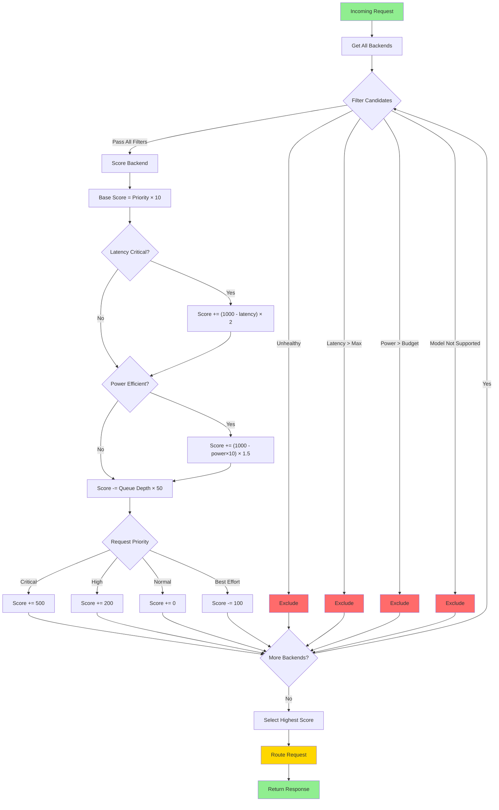

# Multi-Backend Routing

The Ollama Proxy router intelligently selects the best backend for each request based on multiple factors including latency requirements, power constraints, thermal state, queue depth, and priority levels.

---

## Overview

The router implements a **scoring-based selection algorithm** that evaluates all healthy backends and selects the one with the highest score based on the request's annotations and current system state.

### Supported Backend Types

- **NPU** (Neural Processing Unit) - Low power (3W), moderate latency (800ms)
- **iGPU** (Integrated GPU) - Balanced (12W, 400ms)
- **NVIDIA GPU** - High performance (55W, 150ms)
- **CPU** - Fallback option (28W, 2000ms)

---

## Routing Algorithm



### 1. Filter Candidates

First, the router filters out backends that don't meet the basic requirements:

```go
// Excluded if:
- Backend is unhealthy
- Latency exceeds X-Max-Latency-Ms constraint
- Power exceeds X-Max-Power-Watts constraint
- Model not supported by backend
```

### 2. Score Candidates

Each remaining backend is scored based on multiple factors:

#### Base Score (Backend Priority)
```go
score += backend.Priority() * 10.0
```

#### Latency Optimization
```go
if annotations.LatencyCritical {
    latencyScore = 1000.0 - backend.AvgLatencyMs()
    score += latencyScore * 2.0  // Weight latency heavily
}
```

**Example:**
- NVIDIA (150ms) gets ~850 points
- NPU (800ms) gets ~200 points

#### Power Efficiency Optimization
```go
if annotations.PreferPowerEfficiency {
    powerScore = 1000.0 - (backend.PowerWatts() * 10)
    score += powerScore * 1.5  // Weight power efficiency
}
```

**Example:**
- NPU (3W) gets ~970 points
- NVIDIA (55W) gets ~450 points

#### Queue Depth Penalty
```go
queueDepth = queueManager.GetQueueDepth(backend.ID(), priority)
queuePenalty = queueDepth * 50.0  // -50 points per pending request
score -= queuePenalty
```

Avoids backends with many pending requests.

#### Priority Boost
```go
if priority == PriorityCritical {
    score += 500.0  // Strong boost for voice/realtime
} else if priority == PriorityHigh {
    score += 200.0  // Moderate boost
}
```

Ensures critical requests get routed to best available backend.

### 3. Select Best Candidate

The backend with the highest score is selected.

---

## Routing Scenarios

### Scenario 1: Latency-Critical Request

```bash
curl http://localhost:8080/v1/chat/completions \
  -H "X-Latency-Critical: true" \
  -d '{"model": "qwen2.5:0.5b", "messages": [...]}'
```

**Routing Decision:**
- Filter: All healthy backends
- Score: NVIDIA gets high latency score (~850 points)
- Result: **Routes to NVIDIA GPU** (fastest)

**Response Headers:**
```
X-Backend-Used: ollama-nvidia
X-Estimated-Latency-Ms: 150
X-Routing-Reason: latency-critical
```

### Scenario 2: Power-Efficient Request (Battery Mode)

```bash
curl http://localhost:8080/v1/chat/completions \
  -H "X-Power-Efficient: true" \
  -d '{"model": "qwen2.5:0.5b", "messages": [...]}'
```

**Routing Decision:**
- Filter: All healthy backends
- Score: NPU gets high power efficiency score (~970 points)
- Result: **Routes to NPU** (3W)

**Response Headers:**
```
X-Backend-Used: ollama-npu
X-Estimated-Power-W: 3.0
X-Routing-Reason: power-efficient
```

### Scenario 3: Balanced Request (No Preference)

```bash
curl http://localhost:8080/v1/chat/completions \
  -d '{"model": "qwen2.5:0.5b", "messages": [...]}'
```

**Routing Decision:**
- Filter: All healthy backends
- Score: Balanced scoring (latency + power) / 2
- Result: **Routes to iGPU** (balanced 12W, 400ms)

**Response Headers:**
```
X-Backend-Used: ollama-igpu
X-Estimated-Latency-Ms: 400
X-Estimated-Power-W: 12.0
X-Routing-Reason: balanced
```

### Scenario 4: Critical Priority (Voice/Realtime)

```bash
curl http://localhost:8080/v1/chat/completions \
  -H "X-Priority: critical" \
  -H "X-Media-Type: realtime" \
  -d '{"model": "qwen2.5:0.5b", "messages": [...]}'
```

**Routing Decision:**
- Filter: All healthy backends
- Score: +500 priority boost, latency optimization
- Result: **Routes to fastest available backend with low queue depth**

**Response Headers:**
```
X-Backend-Used: ollama-nvidia
X-Estimated-Latency-Ms: 150
X-Routing-Reason: critical-priority
```

### Scenario 5: Power Budget Constraint

```bash
curl http://localhost:8080/v1/chat/completions \
  -H "X-Max-Power-Watts: 15" \
  -d '{"model": "qwen2.5:0.5b", "messages": [...]}'
```

**Routing Decision:**
- Filter: Excludes NVIDIA (55W) and CPU (28W)
- Remaining: NPU (3W), iGPU (12W)
- Result: **Routes to iGPU** (best performance within budget)

**Response Headers:**
```
X-Backend-Used: ollama-igpu
X-Estimated-Power-W: 12.0
X-Routing-Reason: balanced
X-Alternatives: ollama-npu
```

### Scenario 6: Congested Backend Avoidance

```
Backend Queue State:
- ollama-nvidia: 5 pending requests (critical priority)
- ollama-igpu: 0 pending requests
- ollama-npu: 1 pending request
```

```bash
curl http://localhost:8080/v1/chat/completions \
  -H "X-Priority: normal" \
  -d '{"model": "qwen2.5:0.5b", "messages": [...]}'
```

**Routing Decision:**
- NVIDIA score penalty: -250 points (5 requests × 50)
- NPU score penalty: -50 points (1 request × 50)
- iGPU score penalty: 0 points
- Result: **Routes to iGPU** (no queue, good balance)

---

## Explicit Backend Selection

You can bypass the routing algorithm and explicitly select a backend:

```bash
curl http://localhost:8080/v1/chat/completions \
  -H "X-Target-Backend: ollama-npu" \
  -d '{"model": "qwen2.5:0.5b", "messages": [...]}'
```

**Behavior:**
- If target backend is healthy → Use it
- If target backend is unhealthy → Fall through to auto-selection

---

## Fallback Mechanism

If a request fails on the selected backend, the router can automatically retry on alternative backends:

```go
decision, err := router.FallbackRequest(ctx, []string{"failed-backend-id"}, annotations)
```

**Fallback Selection:**
- Excludes failed backend
- Scores remaining backends with same algorithm
- Returns next best option

---

## Model Compatibility

Backends can specify which models they support:

```yaml
backends:
  - id: ollama-npu
    model_capability:
      max_model_size_gb: 8
      supported_model_patterns:
        - "*:0.5b"
        - "*:1b"
        - "qwen2.5:*"
      preferred_models:
        - "qwen2.5:0.5b"
      excluded_patterns:
        - "*:70b"  # Too large for NPU
```

**Routing Behavior:**
- Backends that don't support the requested model are filtered out
- Backends with preferred models get priority
- Large models automatically routed to high-memory backends

---

## Queue Management

The router tracks pending requests per backend to avoid hotspots:

### Queue Tracking

```go
// When request starts
queueMgr.MarkRequestStart(backendID, priority)

// When request completes
queueMgr.MarkRequestEnd(backendID, priority)
```

### Weighted Queue Depth

Higher priority requests contribute more to queue depth:

```go
weightedDepth = 0
for priority in [BestEffort, Normal, High, Critical]:
    weightedDepth += count[priority] * (priority + 1)
```

**Example:**
- 1 critical request = 4 points
- 2 normal requests = 4 points
- 4 best-effort requests = 4 points

---

## Configuration

### Router Configuration

```yaml
router:
  default_backend_id: "ollama-igpu"  # Fallback if auto-selection fails
  power_aware: true                   # Enable power-aware routing
  auto_optimize: true                 # Enable automatic optimization
```

### Backend Priority

Higher priority backends are preferred in scoring:

```yaml
backends:
  - id: ollama-nvidia
    priority: 1  # Prefer for high performance

  - id: ollama-igpu
    priority: 2  # Prefer for balanced workloads

  - id: ollama-npu
    priority: 3  # Prefer for power efficiency

  - id: ollama-cpu
    priority: 0  # Fallback only
```

---

## Monitoring

### View Routing Decision

Check response headers to see routing decision:

```bash
curl -i http://localhost:8080/v1/chat/completions \
  -H "X-Latency-Critical: true" \
  -d '{"model": "qwen2.5:0.5b", "messages": [...]}'
```

### Routing Statistics

Query routing stats via D-Bus:

```bash
busctl --user call ie.fio.OllamaProxy.Routing \
  /ie/fio/OllamaProxy/Routing \
  ie.fio.OllamaProxy.Routing \
  GetRoutingStats
```

### Queue Depth

Check current queue depth for all backends:

```bash
curl http://localhost:8080/backends | grep -A 3 "Queue"
```

---

## Best Practices

### 1. Use Priority Levels

Set appropriate priority for your workload:
- **Critical**: Voice, realtime chat, live transcription
- **High**: Interactive chat, important queries
- **Normal**: Most requests
- **Best Effort**: Batch processing, background tasks

### 2. Set Power Constraints

On battery power, set max power budget:

```bash
X-Max-Power-Watts: 15  # Limit to NPU + iGPU
```

### 3. Set Latency Constraints

For interactive applications, set max latency:

```bash
X-Max-Latency-Ms: 500  # Exclude slow backends
```

### 4. Monitor Queue Depth

Avoid overloading specific backends by monitoring queue depth and scaling backends horizontally if needed.

### 5. Use Efficiency Modes

Let the efficiency mode system handle routing automatically based on system state (battery, temperature, etc.).

---

## Troubleshooting

### All Backends Filtered Out

```
Error: no healthy backends available matching criteria
```

**Causes:**
- All backends unhealthy
- Constraints too strict (e.g., X-Max-Latency-Ms: 50)
- Model not supported by any backend

**Solutions:**
- Check backend health: `curl http://localhost:8080/backends`
- Relax constraints
- Verify model compatibility

### Unexpected Backend Selection

Check routing reason in response headers:

```
X-Routing-Reason: queue-depth-5
```

Indicates backend selection was influenced by queue depth. Other backend likely had 5 pending requests.

### Backend Not Being Used

**Possible causes:**
- Backend unhealthy
- Backend priority too low
- Backend doesn't support requested model
- Queue too deep

**Debug:**
```bash
curl http://localhost:8080/backends
# Check: healthy, priority, model_capability
```

---

## Related Documentation

- [Priority Queuing](priority-queuing.md)
- [Power Management](power-management.md)
- [Thermal Monitoring](thermal-monitoring.md)
- [Configuration Guide](../guides/configuration.md)
