# Thermal Monitoring

The Ollama Proxy implements **real-time thermal monitoring** that tracks CPU/GPU temperatures, fan speeds, and thermal throttling events to prevent overheating and optimize performance under thermal constraints.

---

## Overview

Thermal monitoring protects hardware by detecting high temperatures and automatically adjusting routing to cooler backends. This prevents thermal throttling, reduces fan noise, and extends hardware lifespan.

### Monitored Metrics

| Metric | Source | Purpose |
|--------|--------|---------|
| CPU Temperature | `/sys/class/thermal/thermal_zone*` | Detect CPU thermal events |
| GPU Temperature | NVIDIA SMI, AMD sensors | Monitor GPU thermal state |
| Fan Speed | `hwmon` sensors | Track cooling effectiveness |
| Thermal Throttling | Performance counters | Detect throttling events |

---

## How It Works

### 1. Temperature Monitoring

The thermal monitor continuously polls temperature sensors:

```go
type ThermalMonitor struct {
    cpuTempSensor    string
    gpuTempSensor    string
    pollInterval     time.Duration
    thermalThreshold float64  // 85°C default
}

func (tm *ThermalMonitor) MonitorLoop() {
    ticker := time.NewTicker(tm.pollInterval)  // 5 seconds
    defer ticker.Stop()

    for range ticker.C {
        cpuTemp := tm.readCPUTemperature()
        gpuTemp := tm.readGPUTemperature()
        fanSpeed := tm.readFanSpeed()

        if cpuTemp > tm.thermalThreshold || gpuTemp > tm.thermalThreshold {
            tm.handleThermalEvent(cpuTemp, gpuTemp)
        }

        // Publish state to D-Bus
        tm.publishThermalState(cpuTemp, gpuTemp, fanSpeed)
    }
}
```

**Sensor Locations:**
- **CPU:** `/sys/class/thermal/thermal_zone0/temp` (milli-degrees Celsius)
- **NVIDIA GPU:** `nvidia-smi --query-gpu=temperature.gpu --format=csv,noheader`
- **AMD GPU:** `/sys/class/drm/card0/device/hwmon/hwmon*/temp1_input`
- **Fan Speed:** `/sys/class/hwmon/hwmon*/fan*_input` (RPM)

### 2. Thermal Event Detection

```mermaid
flowchart TD
    Start[Monitor Loop<br/>Every 5 seconds] --> Read[Read Sensors]
    Read --> CheckCPU{CPU Temp}
    CheckCPU -->|< 80°C| CheckGPU
    CheckCPU -->|80-85°C| Warning
    CheckCPU -->|85-90°C| High
    CheckCPU -->|> 90°C| Critical

    CheckGPU{GPU Temp}
    CheckGPU -->|< 80°C| Normal[Normal State]
    CheckGPU -->|80-85°C| Warning[Warning Level]
    CheckGPU -->|85-90°C| High[High Temperature]
    CheckGPU -->|> 90°C| Critical[Critical!]

    Warning --> Log[Log Warning]
    Log --> Publish[Publish to D-Bus]

    High --> SwitchQuiet[Switch to Quiet Mode]
    SwitchQuiet --> MarkThrottled[Mark GPU Throttled]
    MarkThrottled --> Notify1[Notify User]
    Notify1 --> Publish

    Critical --> SwitchUltra[Switch to Ultra Efficiency]
    SwitchUltra --> Limit[Limit Concurrency]
    Limit --> Notify2[Critical Notification]
    Notify2 --> Publish

    Normal --> Publish
    Publish --> Wait[Wait 5 seconds]
    Wait --> Start

    style Normal fill:#90EE90
    style Warning fill:#FFD700
    style High fill:#FFA500
    style Critical fill:#FF6B6B
```



When temperature exceeds threshold:

```go
func (tm *ThermalMonitor) handleThermalEvent(cpuTemp, gpuTemp float64) {
    log.Printf("[Thermal] High temperature detected: CPU=%.1f°C, GPU=%.1f°C", cpuTemp, gpuTemp)

    // Determine severity
    if cpuTemp > 90 || gpuTemp > 90 {
        // Critical: Switch to ultra-low-power backends
        tm.efficiencyManager.SetMode(EfficiencyUltraEfficiency)
        tm.notifyUser("Critical temperature detected, reducing performance")
    } else if cpuTemp > 85 || gpuTemp > 85 {
        // High: Switch to quiet mode (low power, low heat)
        tm.efficiencyManager.SetMode(EfficiencyQuiet)
        tm.notifyUser("High temperature detected, entering quiet mode")
    }

    // Mark hot backends as throttled
    if gpuTemp > 85 {
        tm.backendManager.MarkThermalThrottle("ollama-nvidia", true)
    }
}
```

### 3. Backend Thermal State

Backends track their thermal throttling state:

```go
type Backend struct {
    id               string
    thermalThrottled bool
    lastTempReading  float64
}

// Routing considers thermal state
func (r *Router) scoreBackend(backend Backend, annotations Annotations) float64 {
    score := baseScore(backend)

    // Thermal throttling penalty
    if backend.thermalThrottled {
        score -= 1000.0  // Massive penalty, avoid throttled backends
    }

    return score
}
```

### 4. Automatic Recovery

When temperature drops below threshold:

```go
func (tm *ThermalMonitor) checkRecovery() {
    if tm.currentMode == EfficiencyQuiet {
        cpuTemp := tm.readCPUTemperature()
        gpuTemp := tm.readGPUTemperature()

        if cpuTemp < tm.recoveryThreshold && gpuTemp < tm.recoveryThreshold {
            log.Printf("[Thermal] Temperature normalized, returning to auto mode")
            tm.efficiencyManager.SetMode(EfficiencyAuto)
            tm.backendManager.MarkThermalThrottle("ollama-nvidia", false)
        }
    }
}
```

---

## Thermal Response Strategy

### Temperature Thresholds

| Temperature | Action | Backend Selection |
|-------------|--------|-------------------|
| < 70°C | Normal operation | All backends available |
| 70-80°C | Monitor closely | Prefer efficient backends |
| 80-85°C | Warning | Switch to Balanced mode |
| 85-90°C | High temperature | Switch to Quiet mode (NPU/iGPU) |
| > 90°C | Critical | NPU only, reduce concurrency |

### Thermal Event Actions

**1. Temperature 85-90°C:**
```
Action: Switch to Quiet mode
Effect:
  - Route to NPU (3W, minimal heat)
  - Route to iGPU (12W, moderate heat)
  - Avoid NVIDIA GPU (55W, high heat)
  - Avoid CPU (28W, moderate heat)

Result: Reduced heat generation, lower fan speed
```

**2. Temperature > 90°C:**
```
Action: Ultra Efficiency mode + Concurrency limit
Effect:
  - NPU only (3W)
  - Max 2 concurrent requests
  - Notification to user

Result: Minimal heat, system cooling down
```

**3. Thermal Throttling Detected:**
```
Action: Mark backend as throttled
Effect:
  - Backend gets -1000 score penalty
  - Routes to alternative backends
  - Monitor for recovery (< 75°C)

Result: Avoid throttled backend until recovered
```

---

## Thermal Monitoring Scenarios

### Scenario 1: GPU Overheating During Heavy Workload

**Initial State:**
```
Backend: NVIDIA GPU (55W)
GPU Temp: 72°C (normal)
Fan Speed: 2000 RPM
Mode: Performance
```

**Heavy workload starts (100 concurrent requests):**
```
Time 0s: GPU temp 72°C
Time 30s: GPU temp 80°C
Time 60s: GPU temp 87°C ⚠️
```

**Thermal Event Triggered:**
```
[Thermal] High temperature detected: GPU=87°C
[EfficiencyMode] Switching Performance → Quiet
[Routing] New requests route to ollama-npu (3W, low heat)
[Notification] "High temperature detected, reducing GPU load"
```

**Recovery:**
```
Time 90s: GPU temp 82°C (cooling down)
Time 120s: GPU temp 76°C (below recovery threshold)
[Thermal] Temperature normalized, returning to Auto mode
[EfficiencyMode] Switching Quiet → Auto
```

### Scenario 2: Summer Day Operation

**Ambient conditions:**
```
Room temperature: 30°C
Laptop on desk (poor ventilation)
Battery powered
```

**Thermal progression:**
```
Start: CPU 65°C, GPU 60°C (elevated baseline)
After 30 min inference: CPU 78°C, GPU 75°C
After 60 min: CPU 84°C, GPU 82°C (approaching threshold)
```

**Proactive action:**
```
[Thermal] Temperature trending high: CPU=84°C
[EfficiencyMode] Preemptively switching to Balanced mode
[Routing] Prefer NPU and iGPU (lower heat generation)
```

**Result:** Temperature stabilizes at 78-80°C without triggering thermal throttling.

### Scenario 3: Fan Failure Detection

**Normal state:**
```
CPU Temp: 70°C
Fan Speed: 2500 RPM
```

**Fan fails:**
```
CPU Temp: 70°C → 85°C → 92°C (rapid increase)
Fan Speed: 2500 RPM → 0 RPM (stopped)
```

**Thermal monitor detects anomaly:**
```
[Thermal] CRITICAL: Temperature spike detected
[Thermal] Fan speed: 0 RPM (possible fan failure)
[EfficiencyMode] Emergency mode: NPU only
[Notification] "Critical: Possible fan failure, minimal performance mode"
[Action] Limit to 1 concurrent request
```

**User action required:** Check fan, restart system, or shutdown if overheating continues.

---

## Configuration

### Thermal Thresholds

Configure temperature thresholds in `config/config.yaml`:

```yaml
thermal:
  enabled: true
  poll_interval_seconds: 5       # Check every 5 seconds

  # Temperature thresholds (°C)
  thresholds:
    warning: 80                  # Start monitoring
    high: 85                     # Switch to Quiet mode
    critical: 90                 # Ultra Efficiency mode
    recovery: 75                 # Return to normal

  # Sensor paths
  sensors:
    cpu_thermal_zone: "/sys/class/thermal/thermal_zone0/temp"
    nvidia_gpu: "nvidia-smi"     # Use nvidia-smi command
    amd_gpu: "/sys/class/drm/card0/device/hwmon/hwmon0/temp1_input"
    fan_speed: "/sys/class/hwmon/hwmon1/fan1_input"

  # Actions
  actions:
    notify_user: true            # Send desktop notification
    auto_switch_mode: true       # Auto switch efficiency mode
    mark_throttled: true         # Mark hot backends as throttled
```

### Sensor Detection

Auto-detect thermal sensors on startup:

```go
func (tm *ThermalMonitor) detectSensors() {
    // Find CPU thermal zone
    zones, _ := filepath.Glob("/sys/class/thermal/thermal_zone*/type")
    for _, zone := range zones {
        zoneType, _ := os.ReadFile(zone)
        if strings.Contains(string(zoneType), "x86_pkg_temp") {
            tm.cpuTempSensor = strings.Replace(zone, "type", "temp", 1)
            log.Printf("[Thermal] Detected CPU sensor: %s", tm.cpuTempSensor)
        }
    }

    // Detect NVIDIA GPU
    if _, err := exec.Command("nvidia-smi").Run(); err == nil {
        tm.gpuTempSensor = "nvidia-smi"
        log.Printf("[Thermal] Detected NVIDIA GPU")
    }

    // Detect AMD GPU
    amdSensors, _ := filepath.Glob("/sys/class/drm/card*/device/hwmon/hwmon*/temp1_input")
    if len(amdSensors) > 0 {
        tm.gpuTempSensor = amdSensors[0]
        log.Printf("[Thermal] Detected AMD GPU sensor: %s", tm.gpuTempSensor)
    }
}
```

---

## Monitoring

### Query Thermal State

**HTTP API:**
```bash
curl http://localhost:8080/thermal
```

**Response:**
```json
{
  "cpu_temperature_c": 72.5,
  "gpu_temperature_c": 68.0,
  "fan_speed_rpm": 2300,
  "thermal_state": "normal",
  "throttled_backends": [],
  "last_thermal_event": null
}
```

**D-Bus API:**
```bash
busctl --user call ie.fio.OllamaProxy.Thermal \
  /ie/fio/OllamaProxy/Thermal \
  ie.fio.OllamaProxy.Thermal \
  GetThermalState
```

### Monitor Temperature Trends

Track temperature over time:

```bash
# Log temperature every 5 seconds
while true; do
  curl -s http://localhost:8080/thermal | \
    jq -r '"CPU: \(.cpu_temperature_c)°C, GPU: \(.gpu_temperature_c)°C, Fan: \(.fan_speed_rpm) RPM"'
  sleep 5
done
```

**Example output:**
```
CPU: 68.0°C, GPU: 65.0°C, Fan: 2000 RPM
CPU: 72.5°C, GPU: 70.0°C, Fan: 2500 RPM
CPU: 78.0°C, GPU: 75.0°C, Fan: 3000 RPM
CPU: 82.0°C, GPU: 78.0°C, Fan: 3500 RPM
[Thermal event triggered]
CPU: 79.0°C, GPU: 74.0°C, Fan: 3200 RPM (cooling down)
```

### View Thermal Events

Query thermal event history:

```bash
journalctl --user -u ie.fio.ollamaproxy.service | grep -E "\[Thermal\]"
```

**Example logs:**
```
[Thermal] Monitor started: CPU sensor detected at thermal_zone0
[Thermal] GPU sensor: nvidia-smi
[Thermal] Warning: CPU temperature 82°C (threshold: 80°C)
[Thermal] High temperature detected: GPU=87°C
[Thermal] Switching to Quiet mode
[Thermal] Temperature normalized: CPU=76°C, GPU=73°C
[Thermal] Returning to Auto mode
```

---

## GNOME Integration

The GNOME Shell extension displays thermal status:

### Thermal Indicator

**Top Bar Indicator:**
```
[🌡️ 72°C] AI Efficiency
```

**Color Coding:**
- **Green (<80°C):** Normal temperature
- **Yellow (80-85°C):** Elevated temperature
- **Orange (85-90°C):** High temperature
- **Red (>90°C):** Critical temperature

### Thermal Notifications

Desktop notifications for thermal events:

**High Temperature:**
```
Notification: "AI Proxy: High Temperature"
Body: "GPU temperature 87°C. Switching to Quiet mode to reduce heat."
Icon: ⚠️
```

**Critical Temperature:**
```
Notification: "AI Proxy: Critical Temperature"
Body: "System temperature 92°C. Performance severely reduced."
Icon: 🔥
Urgency: Critical
```

**Temperature Normalized:**
```
Notification: "AI Proxy: Temperature Normal"
Body: "Temperature back to normal (74°C). Returning to Auto mode."
Icon: ✅
```

### Quick Settings Panel

Thermal status in Quick Settings:

```
╔══════════════════════════════════════╗
║ AI Efficiency: Quiet                 ║
╠══════════════════════════════════════╣
║ 🌡️ Temperature: 87°C (High)         ║
║ 🔥 Thermal Event Active              ║
║ 💨 Fan Speed: 3500 RPM               ║
║                                      ║
║ Backends:                            ║
║   ✅ NPU (3W) - Active               ║
║   ✅ iGPU (12W) - Active             ║
║   ⚠️ NVIDIA (55W) - Throttled        ║
╚══════════════════════════════════════╝
```

---

## Best Practices

### 1. Enable Thermal Monitoring

Ensure thermal monitoring is enabled:

```yaml
# config/config.yaml
thermal:
  enabled: true
  auto_switch_mode: true
```

### 2. Set Conservative Thresholds for Quiet Environments

For laptops in quiet environments:

```yaml
thermal:
  thresholds:
    high: 75      # Lower threshold for earlier action
    critical: 85  # More conservative
```

### 3. Monitor Thermal State During Heavy Workloads

Before running heavy batch jobs:

```bash
# Check thermal headroom
curl http://localhost:8080/thermal

# If temperature already elevated, use Quiet mode
curl -X POST http://localhost:8080/efficiency -d '{"mode": "Quiet"}'
```

### 4. Improve Ventilation

Physical recommendations:
- Use laptop cooling pad
- Ensure air vents not blocked
- Clean dust from fans regularly
- Elevate laptop for better airflow

### 5. Profile Thermal Impact of Backends

Identify which backend generates most heat:

```bash
#!/bin/bash
# Thermal profiling script

for backend in ollama-npu ollama-igpu ollama-nvidia; do
  echo "Testing $backend..."

  # Start temperature
  start_temp=$(curl -s http://localhost:8080/thermal | jq -r '.gpu_temperature_c')

  # Run 50 requests on specific backend
  for i in {1..50}; do
    curl -s http://localhost:8080/v1/chat/completions \
      -H "X-Target-Backend: $backend" \
      -d '{"model": "qwen2.5:0.5b", "messages": [{"role": "user", "content": "Test"}]}' > /dev/null
    sleep 1
  done

  # End temperature
  end_temp=$(curl -s http://localhost:8080/thermal | jq -r '.gpu_temperature_c')

  temp_increase=$(echo "$end_temp - $start_temp" | bc)
  echo "$backend: +${temp_increase}°C"

  # Cool down
  sleep 60
done
```

**Expected results:**
- NPU: +2-5°C (minimal heat)
- iGPU: +5-10°C (moderate heat)
- NVIDIA: +15-25°C (significant heat)

---

## Troubleshooting

### Temperature Sensor Not Detected

**Symptoms:**
```
[Thermal] No CPU sensor detected
```

**Solution:**
```bash
# Check available thermal zones
ls -la /sys/class/thermal/thermal_zone*/

# Find your CPU sensor
for zone in /sys/class/thermal/thermal_zone*/type; do
  echo "$zone: $(cat $zone)"
done

# Update config with correct sensor
vim config/config.yaml
# Set: sensors.cpu_thermal_zone: "/sys/class/thermal/thermal_zone2/temp"
```

### False Thermal Events

**Symptoms:**
- Thermal events triggered but temperature normal
- Frequent mode switching

**Check:**
```bash
# Read raw sensor value
cat /sys/class/thermal/thermal_zone0/temp
# Should be in milli-degrees (e.g., 72000 = 72°C)

# Check if proxy reading correctly
curl http://localhost:8080/thermal | jq '.cpu_temperature_c'
```

**Possible cause:** Sensor reading in wrong unit (degrees instead of milli-degrees)

**Solution:**
```go
// In thermal monitor code
temp := readSensorValue()
if temp > 200 {
    // Value likely in milli-degrees
    temp = temp / 1000.0
}
```

### GPU Temperature Not Monitored

**NVIDIA GPU:**
```bash
# Check nvidia-smi available
nvidia-smi --query-gpu=temperature.gpu --format=csv,noheader

# If not found, install NVIDIA drivers
sudo dnf install nvidia-driver nvidia-settings
```

**AMD GPU:**
```bash
# Find AMD sensor
find /sys/class/drm/card*/device/hwmon/hwmon*/temp1_input

# Update config with correct path
```

### Fan Speed Not Reported

**Check:**
```bash
# Find fan sensors
find /sys/class/hwmon/hwmon*/fan*_input

# Test reading
cat /sys/class/hwmon/hwmon1/fan1_input
# Should show RPM value (e.g., 2500)
```

**If no fan sensors found:**
- Some systems don't expose fan speed
- Thermal monitoring still works (temperature-based)

---

## Advanced Features

### Thermal Throttling Detection

Detect when GPU is already thermally throttling:

```go
func (tm *ThermalMonitor) detectThrottling() bool {
    // NVIDIA: Check throttle reasons
    output, _ := exec.Command("nvidia-smi",
        "--query-gpu=clocks_throttle_reasons.active",
        "--format=csv,noheader").Output()

    throttleReasons := strings.TrimSpace(string(output))
    if throttleReasons != "0x0000000000000000" {
        log.Printf("[Thermal] GPU throttling active: %s", throttleReasons)
        return true
    }

    return false
}
```

### Predictive Thermal Management

Predict thermal events before they occur:

```go
type ThermalPredictor struct {
    tempHistory []float64
    windowSize  int
}

func (tp *ThermalPredictor) predictThermalEvent() bool {
    if len(tp.tempHistory) < tp.windowSize {
        return false
    }

    // Calculate temperature trend
    recent := tp.tempHistory[len(tp.tempHistory)-tp.windowSize:]
    trend := (recent[len(recent)-1] - recent[0]) / float64(tp.windowSize)

    // If temperature rising >1°C per measurement and currently >75°C
    if trend > 1.0 && recent[len(recent)-1] > 75.0 {
        log.Printf("[Thermal] Predicting thermal event: trend=+%.1f°C", trend)
        return true
    }

    return false
}
```

**Benefit:** Switch to lower-power backends before temperature reaches threshold.

---

## Performance Impact

Thermal monitoring has minimal overhead:

**CPU Usage:** <0.1% (polling every 5 seconds)
**Memory:** ~100KB (sensor readings, history)
**I/O:** Minimal (reading sysfs files)

**Benchmark:**
```bash
# Measure overhead
perf stat -e cycles,instructions,cache-misses \
  -p $(pgrep ollama-proxy) \
  sleep 60

# Thermal monitoring: <0.01% CPU time
```

---

## Related Documentation

- [Power Management](power-management.md) - Power-aware routing
- [Efficiency Modes](efficiency-modes.md) - Mode descriptions
- [Multi-Backend Routing](routing.md) - Routing algorithm
- [GNOME Integration](../guides/gnome-integration.md) - Desktop notifications
