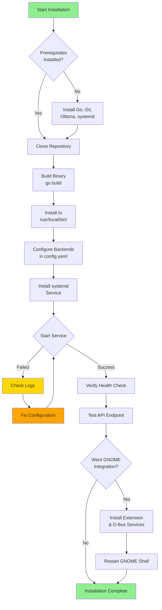

# Installation Guide

Complete installation instructions for the Ollama Proxy on Linux systems.

---

## Prerequisites

### System Requirements

| Component | Requirement |
|-----------|-------------|
| **OS** | Linux (Fedora, Ubuntu, Debian, Arch) |
| **Go** | 1.21 or higher |
| **Memory** | 2GB RAM minimum (4GB+ recommended) |
| **Disk** | 500MB for proxy, models stored separately |
| **Desktop** | GNOME 45+ (optional, for desktop integration) |

### Required Software

**Core dependencies:**
```bash
# Fedora/RHEL
sudo dnf install golang git systemd

# Ubuntu/Debian
sudo apt install golang git systemd

# Arch Linux
sudo pacman -S go git systemd
```

**Optional (for GNOME integration):**
```bash
# Fedora
sudo dnf install gnome-shell glib2-devel

# Ubuntu/Debian
sudo apt install gnome-shell libglib2.0-dev

# Arch
sudo pacman -S gnome-shell glib2
```

**Ollama (required for backends):**
```bash
# Install Ollama
curl -fsSL https://ollama.com/install.sh | sh

# Verify installation
ollama --version
```

---

## Installation Methods

### Installation Workflow



### Method 1: Build from Source (Recommended)

#### 1. Clone Repository

```bash
cd ~/src  # Or your preferred directory
git clone https://github.com/daoneill/ollama-proxy.git
cd ollama-proxy
```

#### 2. Build Proxy Binary

```bash
# Build
go build -o ollama-proxy ./cmd/proxy

# Verify build
./ollama-proxy --version
```

**Expected output:**
```
Ollama Proxy v0.1.0
```

#### 3. Install Binary

```bash
# Install to system location
sudo cp ollama-proxy /usr/local/bin/

# Verify installation
which ollama-proxy
# Should output: /usr/local/bin/ollama-proxy
```

#### 4. Create Configuration

```bash
# Create config directory
mkdir -p ~/.config/ollama-proxy

# Copy default config
cp config/config.yaml ~/.config/ollama-proxy/

# Or keep config in project directory (recommended during development)
# The systemd service will use the project directory
```

---

### Method 2: Using go install

```bash
go install github.com/daoneill/ollama-proxy/cmd/proxy@latest

# Binary installed to $GOPATH/bin/ollama-proxy
# Add to PATH if needed:
export PATH="$PATH:$(go env GOPATH)/bin"
```

---

## Backend Setup

The proxy requires at least one Ollama backend to be running.

### Install Ollama Backends

```bash
# Pull models for different backends
ollama pull qwen2.5:0.5b    # Small model for NPU/iGPU
ollama pull llama3.2:3b     # Larger model for GPU
```

### Configure Backend Endpoints

Edit `config/config.yaml`:

```yaml
backends:
  - id: ollama-npu
    type: ollama
    name: "Ollama NPU"
    hardware: npu
    enabled: true
    endpoint: "http://localhost:11434"
    characteristics:
      power_watts: 3.0
      avg_latency_ms: 800
      priority: 3

  - id: ollama-igpu
    type: ollama
    name: "Ollama iGPU"
    hardware: igpu
    enabled: true
    endpoint: "http://localhost:11434"
    characteristics:
      power_watts: 12.0
      avg_latency_ms: 400
      priority: 2

  # Add more backends as needed
```

**Note:** For single-backend setups, all backend IDs can point to the same Ollama instance. The proxy will still provide routing, monitoring, and efficiency mode features.

### Verify Backend Connection

```bash
# Test Ollama is running
curl http://localhost:11434/api/tags

# Should return list of models
```

---

## systemd Service Installation

### 1. Install Service File

```bash
# Copy service file
cp data/ie.fio.ollamaproxy.service ~/.config/systemd/user/

# Important: Update WorkingDirectory in service file
nano ~/.config/systemd/user/ie.fio.ollamaproxy.service
```

**Edit WorkingDirectory:**
```ini
[Service]
Type=simple
WorkingDirectory=/home/YOUR_USERNAME/src/ollama-proxy  # Update this path
ExecStart=/usr/local/bin/ollama-proxy
Restart=on-failure
RestartSec=5
```

### 2. Reload systemd

```bash
systemctl --user daemon-reload
```

### 3. Enable and Start Service

```bash
# Enable auto-start on login
systemctl --user enable ie.fio.ollamaproxy.service

# Start service
systemctl --user start ie.fio.ollamaproxy.service

# Check status
systemctl --user status ie.fio.ollamaproxy.service
```

**Expected output:**
```
● ie.fio.ollamaproxy.service - Ollama Proxy Service
     Loaded: loaded (/home/user/.config/systemd/user/ie.fio.ollamaproxy.service; enabled)
     Active: active (running) since Sat 2025-01-11 14:30:00 UTC; 5s ago
   Main PID: 12345 (ollama-proxy)
     Status: "Proxy started successfully"
     CGroup: /user.slice/user-1000.slice/user@1000.service/ie.fio.ollamaproxy.service
             └─12345 /usr/local/bin/ollama-proxy

Jan 11 14:30:00 hostname systemd[1234]: Started Ollama Proxy Service.
Jan 11 14:30:00 hostname ollama-proxy[12345]: [INFO] Starting Ollama Proxy
Jan 11 14:30:00 hostname ollama-proxy[12345]: [INFO] gRPC server listening on :50051
Jan 11 14:30:00 hostname ollama-proxy[12345]: [INFO] HTTP server listening on :8080
```

### 4. View Logs

```bash
# Follow logs
journalctl --user -u ie.fio.ollamaproxy.service -f

# View recent logs
journalctl --user -u ie.fio.ollamaproxy.service -n 50

# View logs since boot
journalctl --user -u ie.fio.ollamaproxy.service -b
```

---

## GNOME Integration (Optional)

### 1. Run Installation Script

```bash
cd ~/src/ollama-proxy
./scripts/install-gnome-integration.sh
```

The script will:
1. Install GSettings schema
2. Install desktop entry
3. Install systemd service
4. Install GNOME Shell extension
5. Prompt to enable auto-start
6. Prompt to start service

### 2. Manual Installation

If the script fails, install components manually:

#### Install GSettings Schema

```bash
# Create schema directory
mkdir -p ~/.local/share/glib-2.0/schemas

# Copy schema
cp data/ie.fio.ollamaproxy.gschema.xml ~/.local/share/glib-2.0/schemas/

# Compile schemas
glib-compile-schemas ~/.local/share/glib-2.0/schemas/

# Verify
gsettings list-schemas | grep ie.fio.ollamaproxy
```

#### Install Desktop Entry

```bash
# Copy desktop file
mkdir -p ~/.local/share/applications
cp data/ie.fio.ollamaproxy.desktop ~/.local/share/applications/

# Update desktop database
update-desktop-database ~/.local/share/applications/
```

#### Install GNOME Shell Extension

```bash
# Create extension directory
mkdir -p ~/.local/share/gnome-shell/extensions/ollamaproxy@anthropic.com

# Copy extension files
cp -r gnome-shell-extension/* ~/.local/share/gnome-shell/extensions/ollamaproxy@anthropic.com/

# Enable extension
gnome-extensions enable ollamaproxy@anthropic.com

# Verify
gnome-extensions list | grep ollama
```

### 3. Restart GNOME Shell

**X11:**
```
Press Alt+F2, type 'r', press Enter
```

**Wayland:**
```
Log out and log back in
```

### 4. Verify Extension

After restart, look for the **AI Efficiency** indicator in the Quick Settings panel (top-right corner).

---

## Verification

### 1. Check Service Status

```bash
systemctl --user status ie.fio.ollamaproxy.service
```

Should show: `Active: active (running)`

### 2. Test HTTP Endpoint

```bash
# Health check
curl http://localhost:8080/health

# Should return:
{"status":"healthy","backends":4,"healthy_backends":4}
```

### 3. Test Backend Listing

```bash
curl http://localhost:8080/backends | jq
```

**Expected output:**
```json
[
  {
    "id": "ollama-npu",
    "name": "Ollama NPU",
    "health": {
      "healthy": true,
      "last_check": "2025-01-11T14:30:00Z"
    },
    "characteristics": {
      "power_watts": 3.0,
      "avg_latency_ms": 800
    }
  },
  ...
]
```

### 4. Test Inference

```bash
curl http://localhost:8080/v1/chat/completions \
  -H "Content-Type: application/json" \
  -d '{
    "model": "qwen2.5:0.5b",
    "messages": [{"role": "user", "content": "Hello!"}]
  }' | jq
```

### 5. Test gRPC (Optional)

```bash
# Install grpcurl
go install github.com/fullstorydev/grpcurl/cmd/grpcurl@latest

# List services
grpcurl -plaintext localhost:50051 list

# Health check
grpcurl -plaintext localhost:50051 ollama_proxy.OllamaProxy/HealthCheck
```

### 6. Test D-Bus (GNOME Integration)

```bash
# List D-Bus services
busctl --user list | grep ie.fio.OllamaProxy

# Get efficiency mode
busctl --user call ie.fio.OllamaProxy.Efficiency \
  /ie/fio/OllamaProxy/Efficiency \
  ie.fio.OllamaProxy.Efficiency \
  GetEfficiencyMode
```

---

## Configuration

### Edit Configuration File

```bash
# If using project directory
nano ~/src/ollama-proxy/config/config.yaml

# If using ~/.config
nano ~/.config/ollama-proxy/config.yaml
```

### Common Configuration Changes

#### Change Server Ports

```yaml
server:
  grpc_port: 50051  # Change if port conflict
  http_port: 8080   # Change if port conflict
  host: "0.0.0.0"   # Or "127.0.0.1" for localhost only
```

#### Enable/Disable Backends

```yaml
backends:
  - id: ollama-npu
    enabled: true    # Set to false to disable

  - id: ollama-igpu
    enabled: false   # Disabled
```

#### Adjust Power Thresholds

```yaml
efficiency_modes:
  auto:
    battery_thresholds:
      ultra_efficiency: 20    # Battery % for ultra efficiency
      efficiency: 50          # Battery % for efficiency
      balanced: 80            # Battery % for balanced
```

#### Adjust Thermal Thresholds

```yaml
thermal:
  enabled: true
  thresholds:
    warning: 80     # °C
    high: 85        # °C
    critical: 90    # °C
```

### Apply Configuration Changes

```bash
# Restart service to apply changes
systemctl --user restart ie.fio.ollamaproxy.service

# Check logs for errors
journalctl --user -u ie.fio.ollamaproxy.service -n 20
```

---

## Troubleshooting Installation

### Service Fails to Start

**Check logs:**
```bash
journalctl --user -u ie.fio.ollamaproxy.service -n 50
```

**Common issues:**

1. **Config file not found:**
   ```
   Error: failed to read config file: open config/config.yaml: no such file or directory
   ```
   **Fix:** Update `WorkingDirectory` in service file to point to project directory.

2. **Port already in use:**
   ```
   Error: bind: address already in use
   ```
   **Fix:** Change port in `config/config.yaml` or stop conflicting service.

3. **Backend unreachable:**
   ```
   Error: failed to connect to backend ollama-npu: connection refused
   ```
   **Fix:** Ensure Ollama is running: `systemctl status ollama` or `ollama serve`

### GNOME Extension Not Showing

**Check if enabled:**
```bash
gnome-extensions list | grep ollama
```

**If not listed:**
```bash
# Install manually (see GNOME Integration section above)
```

**If listed but not enabled:**
```bash
gnome-extensions enable ollamaproxy@anthropic.com
```

**Restart GNOME Shell:**
- X11: Alt+F2, type 'r', Enter
- Wayland: Log out, log back in

**Check extension errors:**
```bash
journalctl -f /usr/bin/gnome-shell
```

### GSettings Schema Not Found

**Verify schema installed:**
```bash
gsettings list-schemas | grep ie.fio.ollamaproxy
```

**If not found:**
```bash
# Recompile schemas
glib-compile-schemas ~/.local/share/glib-2.0/schemas/

# Verify
gsettings list-schemas | grep ie.fio.ollamaproxy
```

### D-Bus Services Not Available

**Check if proxy is running:**
```bash
systemctl --user status ie.fio.ollamaproxy.service
```

**List D-Bus services:**
```bash
busctl --user list | grep ie.fio
```

**If not listed:**
- Service not running, or
- D-Bus registration failed (check logs)

### Permission Denied Errors

**Make binary executable:**
```bash
chmod +x /usr/local/bin/ollama-proxy
```

**Check file ownership:**
```bash
ls -la /usr/local/bin/ollama-proxy
```

**Config directory permissions:**
```bash
chmod 755 ~/.config/ollama-proxy
chmod 644 ~/.config/ollama-proxy/config.yaml
```

---

## Uninstallation

### Remove Service

```bash
# Stop and disable service
systemctl --user stop ie.fio.ollamaproxy.service
systemctl --user disable ie.fio.ollamaproxy.service

# Remove service file
rm ~/.config/systemd/user/ie.fio.ollamaproxy.service

# Reload systemd
systemctl --user daemon-reload
```

### Remove Binary

```bash
sudo rm /usr/local/bin/ollama-proxy
```

### Remove GNOME Integration

```bash
# Disable extension
gnome-extensions disable ollamaproxy@anthropic.com

# Remove extension
rm -rf ~/.local/share/gnome-shell/extensions/ollamaproxy@anthropic.com

# Remove GSettings schema
rm ~/.local/share/glib-2.0/schemas/ie.fio.ollamaproxy.gschema.xml
glib-compile-schemas ~/.local/share/glib-2.0/schemas/

# Remove desktop entry
rm ~/.local/share/applications/ie.fio.ollamaproxy.desktop
update-desktop-database ~/.local/share/applications/
```

### Remove Configuration

```bash
rm -rf ~/.config/ollama-proxy
```

### Remove Source

```bash
rm -rf ~/src/ollama-proxy
```

---

## Next Steps

After installation:

1. **Configure backends** - See [Configuration Guide](configuration.md)
2. **Test inference** - Try OpenAI-compatible API calls
3. **Set up GNOME integration** - Install extension for desktop control
4. **Read feature docs** - Learn about routing, power management, etc.

---

## Related Documentation

- [Configuration Guide](configuration.md) - Detailed configuration options
- [GNOME Integration](gnome-integration.md) - Desktop integration setup
- [Troubleshooting](troubleshooting.md) - Common issues and solutions
- [OpenAI API](../api/openai-compatibility.md) - API usage examples
